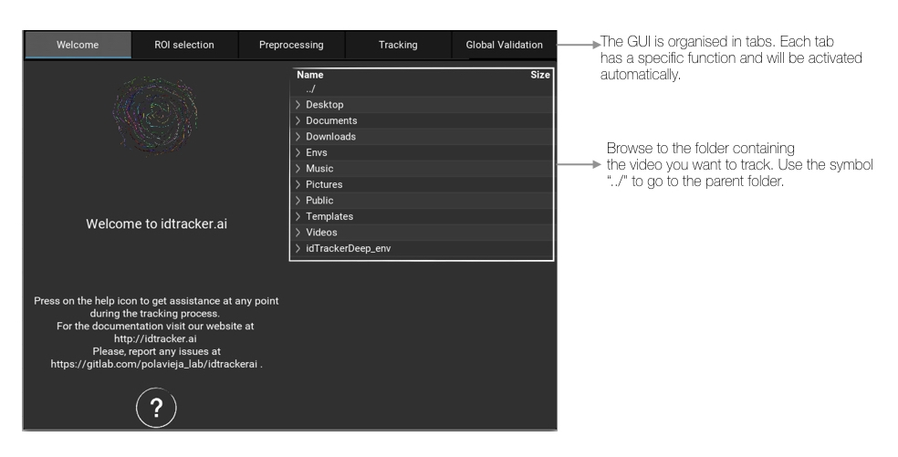
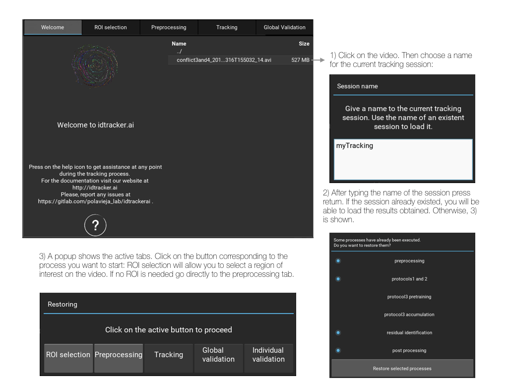
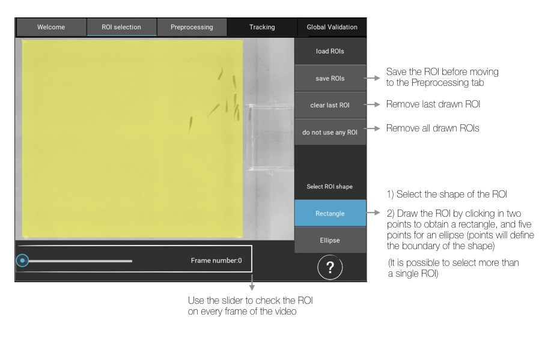
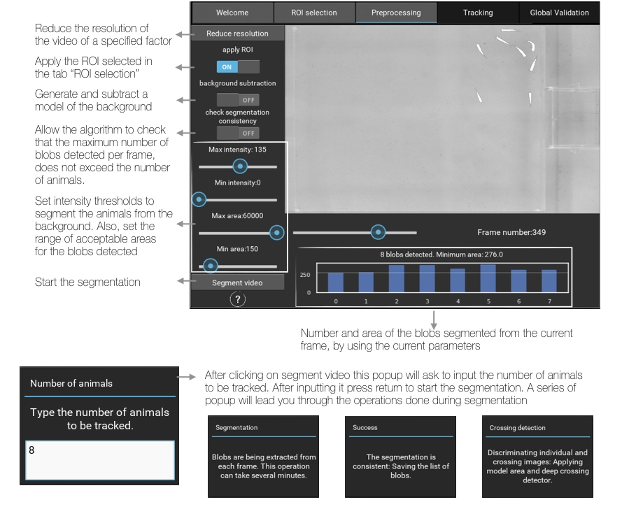
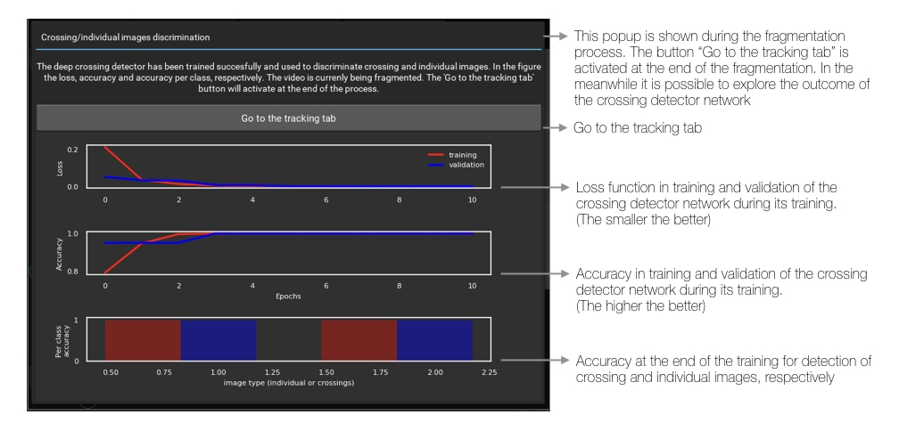
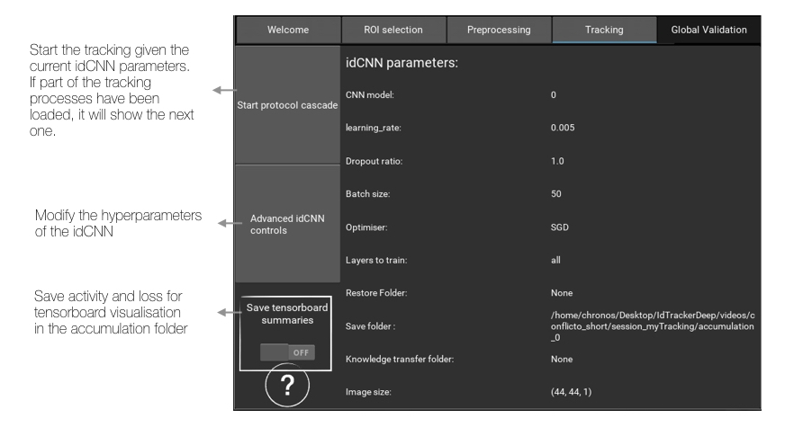
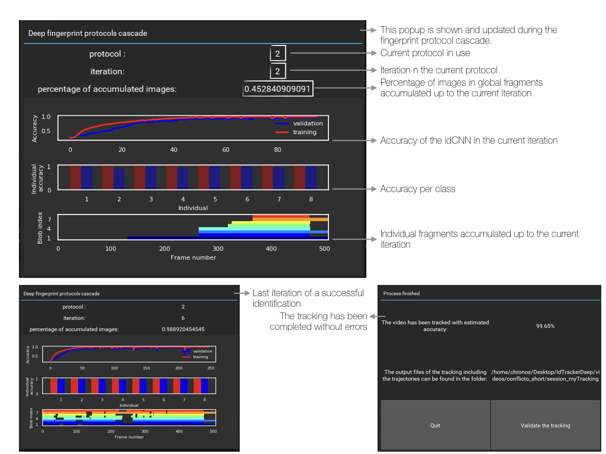
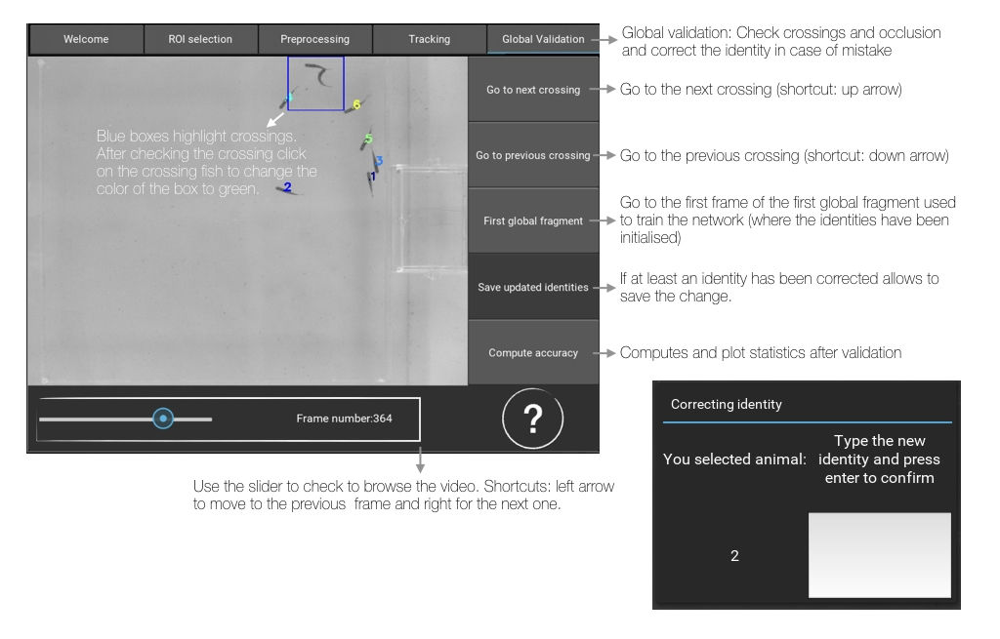

Graphical user interface (GUI)
==============================

idtracker.ai graphical user interface is organized in tabs that activate and
deactivate along the tracking process in order to guide the user.

^^^^^^^^^^^^^^^
Tab 1. Welcome
^^^^^^^^^^^^^^^

^^^^^^^^^^^^^^^^^^^^^
Tab 2. ROI selection
^^^^^^^^^^^^^^^^^^^^^

^^^^^^^^^^^^^^^^^^^^
Tab 3. Preprocessing
^^^^^^^^^^^^^^^^^^^^

^^^^^^^^^^^^^^^
Tab 4. Tracking
^^^^^^^^^^^^^^^

^^^^^^^^^^^^^^^^^
Tab 5. Validation
^^^^^^^^^^^^^^^^^

