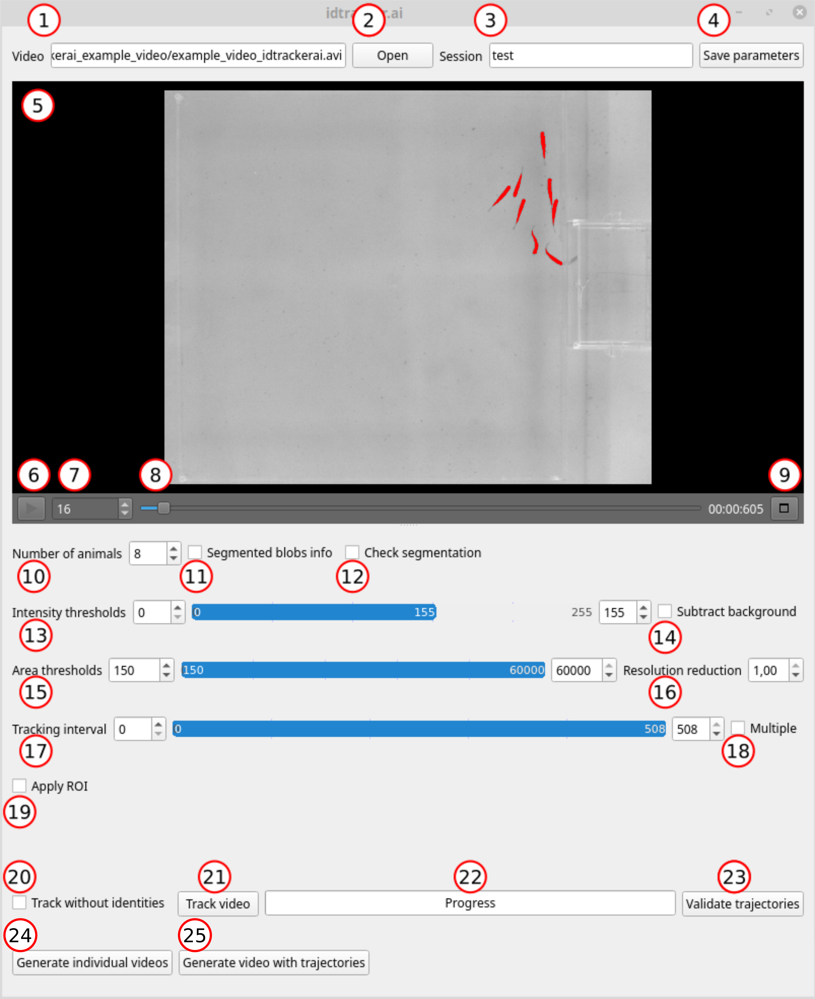
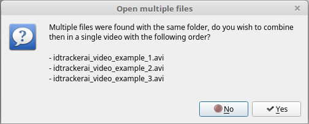
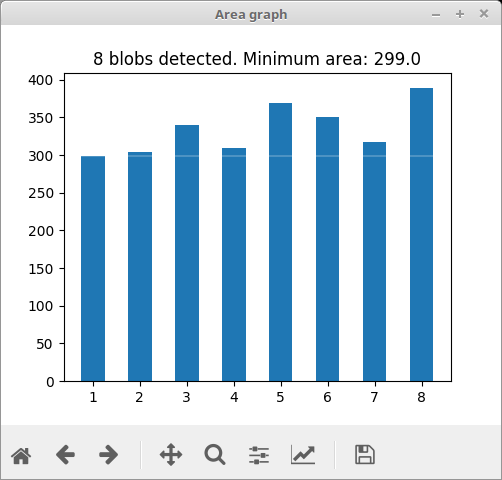
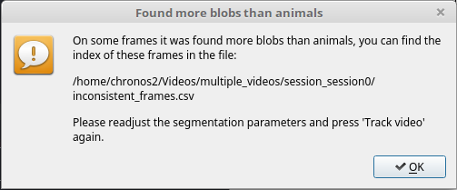
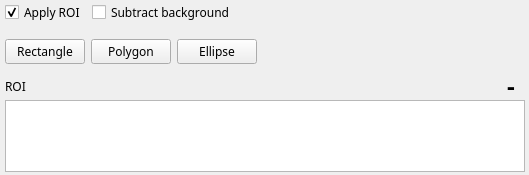
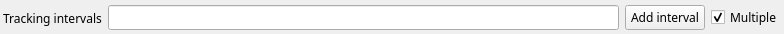
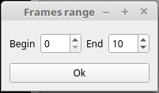
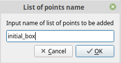
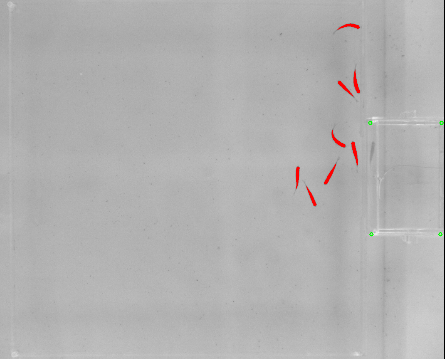
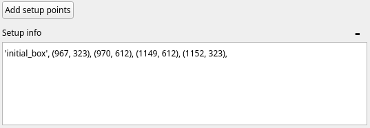

Graphical user interface (GUI)
==============================

The idtracker.ai graphical user interface consists on a main panel and 
different secondary windows. Here, we explain the different 
features of the GUI and how to interact with them.

1. **"Video" text box**
-----------------------

The absolute path to the video that you are going to track will appear in 
this box.

2. **"Open" button**
--------------------

Click *Open* and browse in your folders to find the video. If you are tracking a video that consist on multiple smaller clips and all of them are in the same folder, you will get a windows similar to this one.

Click *YES* if you want to combine the videos in the proposed order.

NOTE: If the last frame of one clip and the first frame of the next clip are not consecutive frames of the same video sequence, we recommend create multiple tracking intervals with 1 frame gaps using the *multiple tracking intervals* feature (see item 18).

3. **"Resolution reduction" text box**
--------------------------------------

Type a value between 0 and 1 to reduce the resolution of the video by that 
factor. 
You can change the value of the box by scrolling up/down or by clicking the 
arrows. 
Note that the output trajectories will be in full-frame resolution.

4. **"Number of animals" text box**
-----------------------------------

Type the number of animals in the video or scroll up/down to change the value 
of the number inside of the box.

5. **"Segmented blobs" info checkbox**
--------------------------------------

Check the box *Graph* to open a windows that will show the number of blobs 
segmented and their area in pixels.

The x-axis indicates the blob index and the y-axis the number of pixels of the 
given blob.

If the windws appears white, move to a different frame using the video player 
controls. This should upate the graph.

6. **"Check segmentation" checkbox**
-------------------------------------

Check this box to be warned if there are some frames in the videos contain 
more segmented blobs that animals. The warning will appear after pressing 
the *Track video* button and after the segmentation process id finished.

You will be shown a message with the path where a *.csv* file containing the 
frame numbers with more blobs than animals. You can use this *.csv* to explore 
your video again and readjust the preprocessing parameters.

NOTE: In the previous version a re-segmentation with the new preprocessing 
parameters would be performed only for those frames. In the current version, 
the segmentation will be run for the whole video again. We might implement 
this feature in the future.

7. **"Intensity thresholds" sliders**
--------------------------------------

Change the minimum and maximum values of the intensity thresholds to select 
the intensity range of the pixels representing the animals to be segmented. 
Values closer to 0 correspond to darker pixels and values closer to 255 
correspond to brighter pixels. You can change the values either by typing 
them inside of the box, scrolling up/down with your cursor on top of the box, 
or by gliding the extremes of the blue bar.

8. **Area thresholds**
-----------------------

Change the minimum and maximum values of the blobs area threshold to discard 
blobs which intensity is in the same intensity range as the animals you want 
to track. Blobs with a number of pixels inside of the range will be considered 
for tracking.

9. **"Apply ROI" checkbox**
----------------------------

To select one or more ROIs check the box Apply ROI. 
New buttons and a text box will appear in the main window.

Click on the buttons *Polygon*, *Rectangle* or *Ellipse* to select the type of 
ROI that you want to draw.

To draw a rectangle, click in one of the corners of the rectangle, a drag 
the cursor to the opposite (diagonally) corner of the rectangle that you want 
to draw.

To draw a polygon, click on every vertex of the polygon.

To draw an ellipse, click in 5 different parts on the perimeter of the ellipse 
that you want to draw.

To delete and ROI click on the set of number representing a given ROI. 
They will be highligthed in blue. Then press the top right minus (-) 
sign to delete it.

Note that each frame is normalized by its average intensity. 
When an ROI is applied, the average intensity is computed
only using values inside the ROI.
This might cause changes in the segmentation and you might need to reajust the
values of the intensity and area thresholds.

10. **"Subtract background" checkbox**
--------------------------------------

Check this box if you want to apply a background subtraction processing. 
Checking this box will compute a model of the background as the average of 
multiple equally spaced frames in the video. This can be used to remove static 
objects that are of the same size and color as the animals you are trying to 
track. If the video is very long, after clicking on the check box, it might 
take a while until the box is actually checked. This happens because while the 
background is being computed, the GUI is held on standby.
Note that when this checkbox is marked, the segmentation might change and you 
might need to readjust intensity thresholds.

11. **Tracking interval" slider**
---------------------------------

You can select a frames range for which the tracking will be performed. 
You can change the minimum and maximum values either by typing them inside of 
the box, scrolling up/down with your cursor on top of the box, or by gliding 
the extremes of the blue bar. The frames outside of this range will be ignored. 
This can be useful if, for example, you want to ignore certain parts of the 
video.

12. **"Multiple" tracking intervals checkbox**
----------------------------------------------

Check the box *Multiple ranges* to add multiple tracking intervals. 
The blue bar will disappear and instead a text box with a *Add range* 
button will appear.

Click the *Add range* button to add the starting and ending frames of a new 
tracking interval.

Alternatively you can add the different intervals by typing inside of the text 
box. Tracking intervals should be expressed with square brackets and separated 
by commas.

Adding tracking intervals can be useful to separated multiple no-consecutive 
videos, or to discard parts of the video that don't have to be considered for 
tracking.

13. **"Add setup info" checkbox**
-----------------------------------
In this new version (v4), we added a feature to annotate groups of points in 
the video frame. We named this feature "Add setup info", becuase we 
originally used it to add information about different points (or landmarks) 
of the experimental setup that were important for the behaviour analysis.

To add a new group of points press the button "Add setup points". 
A new window will appear where you should write the name of the list of points
to be annotatoted.

You can annotate the points by cleacking on the frame in the preview window.

This will add the points in pixels coordinates to the text box on the left.

This list of points will be stored in the `trajectories.npy` and 
`trajectories_wo_gaps.npy` files.

14. **"Session name" text box**
-------------------------------

Type here the name of the tracking session (e.g. *test*, avoid using spaces in 
the session name, use underscores instead). A folder with the name 
*session_test* will be created in the same folder where the video is. 
All the data generated for the tracking of the video and the tracking 
results will be output in this folder.

15. **"Save parameters" button**
--------------------------------

Click *Save parameters* to save the preprocessing parameters of the main panel 
into a *.json* file. You can use this *.json* file to track the video from the 
command line (see :doc:`tracking_from_terminal`). After saving the parameters, 
you can open a new video and continue setting parameters and saving them for 
as many videos as you want.

16. **"Track without identities" checkbox**
-------------------------------------------

Check this box if you want to obtain trajectories of the animals for which the 
identities (columns in the trajectories array) do not necessarily correspond 
to the same animal. The algorithm will skip the core of the tracking where the 
convolutional neural network is trained to identify the animals. Also, be 
aware that the algorithm also skips the interpolation step where the 
trajectories of the individuals in blobs belonging to multiple animals 
(crossings, touches, ...) are assigned.

17. **"Track video" button**
----------------------------

Click the *Track video* button to start tracking the video.

18. **"Progress" bar**
----------------------

The progress bar will advance as the different steps of the algorithm are computed.

19. **"Validate trajectories" button**
--------------------------------------

If the session name corresponds to a tracking session already finished, the 
*Validate trajectories* button will activate. Click on this button to 
open the trajectories validation. A new window will pop up where you will 
be able to explore the outcome of the tracking and correct the possible 
errors (see :doc:`validation_GUI_explained` for more information).

20. **"Generate video with trajectories" button**
-------------------------------------------------

If the session name corrsponds to a tracking session already finished, 
the *Generate video with trajectories* button will activate. 
Click on this butotn if you want to generate a video with the trajectories 
overlayed with the original video. Note that if you have modified the 
identities or the centroids using the *Validate trajectories* button, 
the last trajectories file generated will be used to generate the video 
with trajectories.

21. **"Generate individual videos" button**
-------------------------------------------

If the session name corresponds to a tracking session already finished, 
the *Generated individual videos* button will activate. Click on this button 
if you want to generate videos centered on each individual. These videos can 
be used to annotate body parts and train posture anlysis softwares like 
`LEAP <https://github.com/talmo/leap/wiki>`_ or 
`DeepLabCut <http://www.mousemotorlab.org/deeplabcut>`_. 
The videos will be saved in a folder called "individual videos". 
Note that if you have modified the identities or the centroids using the 
*Validate trajectories* button, the last trajectories file generated will 
be used to generate the individual videos.

22. **Video preview**
---------------------

This window will show the video that you are going to track and the effects of 
the different preprocessing parameters. Segmented blobs of pixels will be 
marked in red color. Regions of interest (ROIs) will be marked in light 
green (see the point 19 to learn how to set ROIs). Zoom in/out by scrolling 
down/up on top of the video image. Click the wheel button (central button on 
most mice) on top of the frame to drag the frame around in the preview window.
By clicking with the right botton of the mouse on the preview image, you 
can activate the "Use scroll to move between frames" freature.

23. **"Play"**
--------------

Press the *PLAY* button to play the video and see the effect of the 
preprocessing parameters for the different frames. By pressing any number 
from 1-9 the video will be fast-forwarded at the respective speed. This 
will allow you to explore the video more quickly. Press the *PAUSE* button 
to pause the video.

24. **"Frame number" text box and track bar**
---------------------------------------------

This box will show the current frame number. Place the cursor on top of the 
box and scroll up/down to increase/decrease the frame number.

You can move to different frames of the video using the track bar. Drag the 
gray square to move to different frames in the video. The numbers next to the 
track bar indicate the time of the video.

25. **"Maximize Preview" button**
---------------------------------

Click this button to pop out the preview windows and place it wherever in 
the screen that suites better your work flow.
To recover the original state of the preview, i.e. inside of the main window, 
just close the player window.

