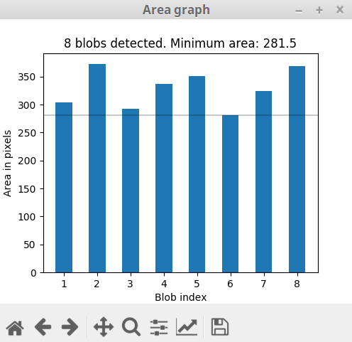

Graphical user interface (GUI)
==============================

The idtracker.ai graphical user interface consists on a main panel and different secondary windows. Here, we explain the different features of the GUI and how to interact with them.

.. figure:: ./_static/gui_pyforms/main_window.png
   :scale: 80 %
   :align: center
   :alt: main panel

1. **Path to the video**
-------------------------

The absolute path to the video that you are going to track will appera in this box.

2. **Browse the video**
-----------------------

Click *Open* and browse in your folders to find the video. If you are tracking a video that consist on multiple smaller clips, or you want to track multiple videos at once (see IDENTITY MATCHING tutorial).

.. figure:: ./_static/gui_pyforms/multiple_videos.png
   :scale: 80 %
   :align: center
   :alt: main pan

| Click *YES* if you want to combine the videos in the proposed order.

NOTE: If the last frame of one clip and the first frame of the next clip are not consecutive frames of the same video sequence, we recommend create multiple tracking intervals with 1 frame gaps using the *multiple tracking intervals* feature (see item 11. and IDENTITY MATCHING tutorial).

3. **Session name**
-------------------

Type here the name of the tracking session (e.g. *test*). A folder with the name *session_test* will be created in the same folder where the video is. All the data generated for the tracking of the video and the tracking results will be output in this folder.

4. **Save parameters**
----------------------

Click *Save parameters* to save the preprocessing parameters of the main panel into a *.json* file. You can use this *.json* file to track the video from the command line (see TRACKING MULTIPLE VIDEOS tutorial). After saving the parameters, you can open a new video and continue setting parameters and saving them for as many videos as you want.

5. **Video preview**
--------------------

This window will show the video that you are going to track and the effects of the different preprocessing parameters. Segmented blobs of pixels will be marked in red color. Regions of interest (ROIs) will be marked in light green (see the point 17 to learn how to set ROIs). You zoom in/out by scrolling down/up on tope of the video image. Click the wheel button (central button on most mice) on top of the frame to drag the frame around in the preview window.

6. **Play**
-----------

Press the *PLAY* button to play the video and see the effect of the preprocessing parameters for the different frames. By pressing any number from 1-9 the video will be fast-forwarded at the respective speed. This will allow you to explore the video more quickly. Press the *PAUSE* button to pause the video.

7. **Frame number**
-------------------

This box will show the current frame number. Place the cursor on top of the box and scroll up/down to increase/decrease the frame number.

8. **Track bar and time**
-------------------------

You can move to different frames of the video using the track bar. Drag the gray square to move to different frames in the video. The numbers next to the track bar indicate the time of the video.

9. **Maximize Preview**
-----------------------

Click this button to pop out the preview windows and place it wherever in the screen that suites better your work flow.

10. **Number of animals**
-------------------------

Type the number of animals in the video or scroll up/down to change the value of the number iside of the box.

11. **Segmented blobs info**
----------------------------

Check the box *Graph* to open a windows that will show the number of blobs segmented and their area in pixels.

The x-axis indicates the blob index and the y-axis the number of pixels of the given blob.

12. **Check segmentation**
--------------------------

Check this box to be warned if there are some frames in the videos contain more segmented blobs that animals. The warning will appear after pressing the *Track video* button and after the segmentation process id finished.

.. figure:: ./_static/gui_pyforms/segmentation_check.png
  :scale: 80 %
  :align: center
  :alt: segmentation check

You will be shown a message with the path where a *.csv* file containing the frame numbers with more blobs than animals. You can use this *.csv* to explore your video again and readjust the preprocessing parameters.

NOTE: In the previous version a re-segmentation with the new preprocessing parameters would be performed only for those frames. In the current version, the segmentation will be run for the whole video again. We might implement this feature back in the future.

13. **Intensity thresholds**
----------------------------

Change the minimum and maximum values of the intensity thresholds to select the intensity range where the animals to be segmented are. Values closer to 0 correspond to darker pixels and values closer to 255 correspond to brighter pixels. You can change the values either by typing them inside of the box, scrolling up/down with your cursor on top of the box, or by gliding the extremes of the blue bar.

14. **Subtract background**
---------------------------

Check this box if you want to apply a background subtraction processing. Checking this box will compute a model of the background as the average of multiple equally spaced frames in the video. This can be used to remove static objects that are of the same size and color as the animals you are trying to track.

15. **Area thresholds**
-----------------------

Change the minimum and maximum values of the blobs area threshold to discard blobs which intensity is in the same intensity range as the animals you want to track. Blobs with a number of pixels inside of the range will be considered for tracking.

16. **Resolution reduction**
----------------------------

Type a value between 0 and 1 to reduce the resolution of the video by that factor. You can change the value of the box by scrolling up/down or by clicking the arrows.

17. **Select a tracking interval**
----------------------------------

You can select a frames range for which the tracking will be performed. You can change the minimum and maxinum values either by typing them inside of the box, scrolling up/down with your cursor on top of the box, or by gliding the extremes of the blue bar. The frames outside of this range will be ignored. This can be useful if, for example, you want to ignore certain parts of the video.

18. **Multiple tracking intervals**
-----------------------------------

Check the box *Multiple ranges* to add multiple tracking intervals. The blue bar will disappear and instead a text box with a *Add ragne* button will appear.

.. figure:: ./_static/gui_pyforms/multiple_range.png
   :scale: 80 %
   :align: center
   :alt: multiple ranges

Click the *Add range* button to add the starting and ending frames of a new tracking interval.

.. figure:: ./_static/gui_pyforms/add_frame_range.png
  :scale: 80 %
  :align: center
  :alt: add frame range

Alternatively you can add the different intervals by typing inside of the text box. Tracking intervals should be expressed with square brackets and separated by commas.

Adding tracking intervals can be useful to separated multiple no-consecutive videos, or to discard parts of the video that don't have to be considered for tracking.

19. **Region of interest (ROI)**
--------------------------------

To select one or more ROIs check the box Apply ROI. New buttons and a text box will appear in the main window.

.. figure:: ./_static/gui_pyforms/ROI-1.png
  :scale: 80 %
  :align: center
  :alt: ROI-1

Click on the buttons *Polygon*, *Rectangle* or *Ellipse* to select the type of ROI that you want to draw.

To draw a polygon......

To draw a rectange.......

To draw an ellipse.......

To delete and ROI click on the set of number representing a given ROI. They will be highligthed in blue. Then press the top right minus (-) sign to delete it.

20. **Track without identities**:
---------------------------------

Check this box if you want to obtain trajectories of the animals for which the identities do not necessarily correspond to a given animal. The algorithm will skip the core of the tracking where the convolutional neural networks are trained to identify the animals. Also, be aware that the algorithm also skips the interpolation step where the trajectories of the blobs belonging to multiple animals (crossings, touches, ...) are assigned.

21. **Track video**
-------------------

Click the *Track video* button to start tracking the video.

22. **Progress bar**
--------------------

The progress bar will advance as the different steps of the algorithm are computed.

23. **Validate trajectories**
-----------------------------

If the session name correspond to a tracking session already finished, the *Validate trajectories* button will activate and a new windows will pop up where you will be able to explore the outcome of the tracking and correct the possible errors (see VALIDATION GUI for more information)
