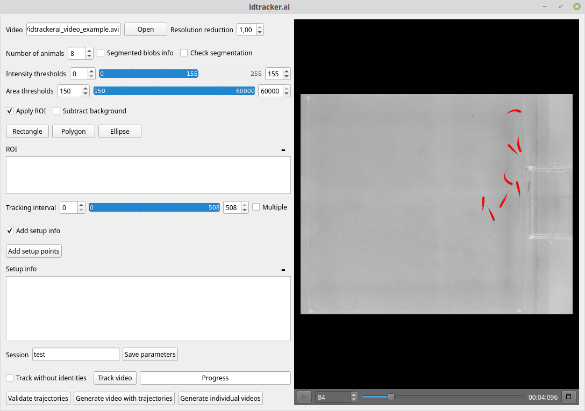

Graphical user interface (GUI)
==============================

The idtracker.ai graphical user interface consists on a main panel and different
secondary windows. Here, we explain the different features of the GUI and how to
interact with them.

1. **Path to the video**: The absolute path to the video that you are going to
track will appera in this box.

2. **Browse the video**: Click *Open* and browse in your folders to find the video.
If you are tracking a video that consist on multiple smaller clips, or you want to track
multiple videos at once (see IDENTITY MATCHING tutorial).

Click *YES* if you want to combine the videos in the proposed order.

NOTE: If the last frame of one clip and the first frame of the next clip
are not consecutive frames of the same video sequence, we recommend create multiple
tracking intervals with 1 frame gaps using the *multiple tracking intervals*
feature (see item 11. and IDENTITY MATCHING tutorial).

3. **Session name**: Type here the name of the tracking session (e.g. *my_test*).
A folder with the name *session_mytest* will be created in the same folder where
the video is. All the data generated for the tracking of the video and the tracking
results will be outputed in this folder.

4. **Save parameters**: Click *Save parameters* to save the preprocessing parameters
of the main panel into a *.json* file. You can use this *.json* file to track the video
from the command line (see TRACKING MULTIPLE VIDEOS tutorial).

5. **Video preview**: This windows will show the video that you are going to track and
the effects of the different preprocessing parameters. Segmented blobs of pixels will
be marked in red color. Regions of interest (ROIs) will be marked in light green
(see the point 17 to learn how to set ROIs). You zoom in/out by scrolling down/up on
tope of the video image.

6. **Play**: Press the *PLAY* button to play the video and see the effect of the preprocessing
parameters for the different frames. By pressing any number from 1-9 the video will be
fast-forwarded at the respective speed. This will allow you to explore the video more quickly.
Press the *PAUSE* button to pause the video.

7. **Frame number**: This box will show the current frame number. Place the cursor on top
of the box and scroll up/down to increase/decrease the frame number.

8. **Track bar and time**: You can move to different frames of the video using the track bar.
Drag the gray square to move to different frames in the video. The numbers next to the track
bar indicate the time of the video.

9. **Maximize Preview**: Click this button to pop out the preview windows and place it wherever
in the screen that suites better your work flow.

10. **Select a tracking interval**: You can select a frames range for which the tracking will
be performed. The frames outside of this range will be ignored. This can be useful if, for example,
you want to ignore certain parts of the video.

11. **Multiple tracking intervals**: Check the box *Multiple ranges* to add multiple tracking intervals.
The blue bar will disappear and instead a text box with a *Add ragne* button will appear.

.. figure:: ./_static/gui_pyforms/multiple_range.png
   :scale: 80 %
   :align: center
   :alt: multiple ranges

Click the *Add range* button to add the starting and ending frames of a new tracking interval.

Alternatively you can add the different intervals by typing inside of the text box.
Tracking intervals should be expressed with square brackets and separated by commas.

Adding tracking intervals can be useful to separated multiple no-consecutive videos,
or to discard parts of the video that don't have to be considered for tracking.

12. **Intensity threshold**:

13. **Blobs area**:

14. **Blobs area graph**:

15. **Number of animals**:

16. **Resolution reduction**:

17. **Region of interest (ROI)**:

18. **Check segmentation**:

19. **Subtract background**:

20. **Track without identities**:

21. **Track video**:

22. **Progress bar**:

23. **Track without identities**:

23. **Validate trajectories**:
