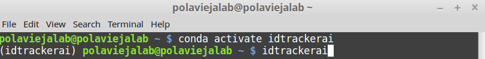
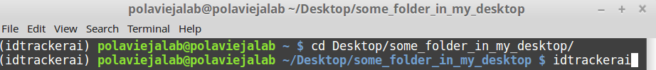
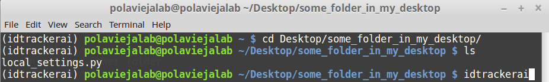

Advanced parameters
===================

The new idtracker.ai v3 allows to set a number of advanced parameters that will allow the user to modify how idtracker.ai behaves in different parts of the algorithm (e.g. memory management, data storage, knowledge transfer...).

To set this advanced parameters, you will need to create a file called "local_settings.py". You can use your favorite text editor to do so. Just remember to save it with the extension ".py".

This file needs to be placed in the same folder where you execute the command "idtrackerai". For example, in Linux, if you execute "idtrackerai" in the default directory (indicated by a ~ symbol) when opening a terminal

the file will need to be stored in the directory "/home/polaviejalab" where you will need to change "polaviejalab" by your username.

If you save the file "local_settings.py" in some folder in your desktop. You will need to use the command "cd" the move to that directory.

You can make sure that the "local_settings.py" file is in the directory where you are placed by running the command "ls".

Let's talk now about the content of the "local_settings.py" file.

This file must contain the assignment of the new values to each advanced parameter. For example, if we want to modify the default number of animals in the GUI, so that we do not need to type every time the number of animals in your experiment, you can include in the "local_settings.py" file the following line:

.. code-block:: python

    NUMBER_OF_ANIMALS_DEFAULT=5

Add this line to the "local_settings.py" file, save it and launch the idtrackerai GUI to see the effect. You should observe that the **Number of animals** box has now the number 5.

Next we explain some of the features that you can modify using the advanced parameters.

Customize the GUI
*****************
When the idtracker.ai GUI is launched, the different parameters appear with some default values. You can modify these default values by modifying the following parameters:

- **NUMBER_OF_ANIMALS_DEFAULT**: Set this constant to any integer to change the default value of the GUI parameter **Number of animals**. The default value is 8.

.. code-block:: python

    NUMBER_OF_ANIMALS_DEFAULT = 8

- **MIN_THRESHOLD_DEFAULT** and **MAX_THRESHOLD_DEFAULT**: Set these constants to any integer between 0 and 255 to modify the minimum and maximum values of the parameter **Intensity thresholds**. The default values of these parameters are 0 and 155 respectively.

.. code-block:: python

    MIN_THRESHOLD_DEFAULT, MAX_THRESHOLD_DEFAULT = 0, 155

- **AREA_LOWER** and **AREA_UPPER**: Set these constants to any integer to change the bounds of the **Area thresholds** slider. The default values are 0 and 60000 respectively. **AREA_LOWER** must be smaller than **AREA_UPPER**.

.. code-block:: python

    AREA_LOWER, AREA_UPPER = 0, 60000

- **MIN_AREA_DEFAULT** and **MAX_AREA_DEFAULT**: Set these constants to any integer to change the minimum and maximum values of the **Area thresholds** parameter. The defaults values are 150 and 60000 respectively.

.. code-block:: python

    MIN_AREA_DEFAULT, MAX_AREA_DEFAULT = 150, 60000

- **RES_REDUCTION_DEFAULT**: Set this constant to any value between 0 and 1 to change the default value of the parameter **Resolution reduction**. The default value of this parameter is 1.0

.. code-block:: python

    RES_REDUCTION_DEFAULT = 1.0

Number of cores in parallel processes
*************************************
- **NUMBER_OF_JOBS_FOR_BACKGROUND_SUBTRACTION**: The value of this constant is directly passed to the parameter *n_jobs* of the `class Parallel <https://joblib.readthedocs.io/en/latest/generated/joblib.Parallel.html>`_ from the *joblib* package during the background subtraction process. Please read the documentation to set a valid value. Note that using to many cores might fill your memory very fast. The default value is -2, according to the documentation, all CPUs but one will be used.

.. code-block:: python

    NUMBER_OF_JOBS_FOR_BACKGROUND_SUBTRACTION = -2

- **NUMBER_OF_JOBS_FOR_SEGMENTATION**: The value of this constant is directly passed to the parameter *n_jobs* of the `class Parallel <https://joblib.readthedocs.io/en/latest/generated/joblib.Parallel.html>`_ from the *joblib* package during the background segmentation process. Please read the documentation to set a valid value. Note that using to many cores might fill your memory very fast. The default value is -2, according to the documentation, all CPUs but one will be used.

.. code-block:: python

    NUMBER_OF_JOBS_FOR_SEGMENTATION = -2

Memory management
*****************
One of the main problems of the idtracker.ai v2 was that all the data generated during the tracking was stored in the RAM. This limited the kind of videos that could be tracked. Long videos (hours), videos with multiple animals (50-100), videos with big animals (> 5000 pixels per animal) required to have >128Gb of RAM memory in the computer. With idtracker.ai the heaviest objects (pixels and segmentation images) are now stored in the disk by default. However, you can decide where this data is saved during the tracking process.

- **SAVE_PIXELS**: Set the value of this constant to one of the strings 'RAM', 'DISK' or 'NOT'. If 'RAM' is selected, the data regrading the pixels of each animals will be saved in your memory as the idtracker.ai v2 did. If 'DISK' is selected, the pixels will be saved in your 'DISK', we recommend running idtracker.ai from solid state hard drives (SSD) so that the saving and loading is faster. If 'NONE', the pixels are computed everytime they are needed. The default value of this constant is 'DISK'.

.. code-block:: python

    SAVE_PIXELS = 'DISK'

- **SAVE_SEGMENTATION_IMAGE**: Same options as the previous constant but for the segmentation images. The default value of this constant is 'DISK'.

.. code-block:: python

    SAVE_SEGMENTATION_IMAGE = 'DISK'

Note that your choice for this two parameters will affect how much time idtracker.ai will take to track a video. 'RAM' will be faster than 'DISK' and 'DISK' faster than 'NONE'.

Plotting training results
*************************

In idtracker.ai v2 the GUI will pop up windows with graphs about the results of the training of the crossing detector, and the training and identification protocol cascade. By default these windows do not appear in the new GUI for idtracker.ai v3. However, you can activate the plotting and saving of these figures using the following constants.

- **PLOT_CROSSING_DETECTOR**: Set this constant to True to plot and save the results of the training of the crossing detector. The default value of this constant is True.

.. code-block:: python

    PLOT_CROSSING_DETECTOR = True

- **PLOT_ACCUMULATION_STEPS**: Set this constant to True to plot and save the results of the training and identification protocol cascade. The default value of this constant is True.

.. code-block:: python

    PLOT_CROSSING_DETECTOR = True

Knowledge transfer and identity transfer
****************************************

You can use the knowledge acquired by a previously trained convolutional neural network as a starting point for the training and identification protocol. This this can be useful to speed up the identification when the videos are very similar (same light conditions, same distance from camera to arena, same type and size of animals). We have observed that the tracking speed is faster but the accuracy does not necessarily increase.

- **KNOWLEDGE_TRANSFER_FOLDER_IDCNN**: Set this constant with a string with the absolute path to an *accumulation* folder from a previous tracking session. For example '/home/username/Videos/example_video/Session_test/accumulation_0'. The default value of this constant is None

.. code-block:: python

    KNOWLEDGE_TRANSFER_FOLDER_IDCNN = None

By default, if the previous constant is not None, idtracker.ai will perform transfer learning from the previous in the given path. The transfer learning will be only for the convolutional layers. If the animals in the video are different, is it better to relearn the classification layer to optimize for the new identities. If the number of animals in the video and the animals are the same, there is the possibility to perform what we call *identity transfer*. Instead of assigning arbitrary identities to the first global fragment, idtracker.ai will use the network from a previous session to assign the identities of the first global fragment in the new video. In our experience, for this to work the video conditions need to be almost identical to the was of the previous video.

- **IDENTITY_TRANSFER**: Set the value of this constant to True if you want to transfer the identities from a previously tracked video. The default value of this constants is False.

.. code-block:: python

    IDENTITY_TRANSFER = False

There are alternative ways of transferring or matching identities between videos. For example, check the tool `idmatcher.ai <https://gitlab.com/polavieja_lab/idmatcherai>`_. To use this tool, the size of the identification images needs to be the same for all the videos.

- **IDENTIFICATION_IMAGE_SIZE**: Set the value of this constant to a tuple of length three (depth, width, height). Note that currently the idtracker.ai networks are only prepared to accept 1-channel images. For example, you could set the identification image size to be (1, 46, 46). The default value of this constant is None, in this case the size of the identification images is computed automatically.

.. code-block:: python

    IDENTIFICATION_IMAGE_SIZE = None

To learn more about the different possibilities of transferring and matching identities check the :doc:`identitiy_matching`.

Data management policy
**********************
- **DATA_POLICY**: Set the value of this constant to one of the 5 possible strings: 'trajectories', 'validation', 'knowledge_transfer', 'idmatcher.ai' or 'all', ordered from less to more data expensive. If the value is 'trajectories', only the trajectories will be saved, the rest of the data will be deleted. If the value is 'validation', only the data necessary to validate the trajectories will be saved, the rest will be deleted. If the value is 'knowledge_transfer', the data necessary to perform transfer learning or identity transfer will be kept. If the value is 'idmatcher.ai', the data necessary to perform the matching of identities using `idmatcher.ai <https://gitlab.com/polavieja_lab/idmatcherai>` will be kept. If the value is 'all', all the data generated during the tracking process will be stored. The default value of this constant is 'all'.

.. code-block:: python

    DATA_POLICY = 'all'

File example
************

Copy the following code in your **local_settings.py** and modify the different parameters according to your needs:

.. code-block:: python

    # GUI defaults
    NUMBER_OF_ANIMALS_DEFAULT = 8
    MIN_THRESHOLD_DEFAULT, MAX_THRESHOLD_DEFAULT = 0, 155
    AREA_LOWER, AREA_UPPER = 0, 60000
    MIN_AREA_DEFAULT, MAX_AREA_DEFAULT = 150, 60000
    RES_REDUCTION_DEFAULT = 1.0

    # Parallel processes
    NUMBER_OF_JOBS_FOR_BACKGROUND_SUBTRACTION = -2
    NUMBER_OF_JOBS_FOR_SEGMENTATION = -2

    # Knowledge transfer and identity transfer
    KNOWLEDGE_TRANSFER_FOLDER_IDCNN = None
    IDENTITY_TRANSFER = False
    IDENTIFICATION_IMAGE_SIZE = None

    # Memory management
    SAVE_PIXELS = 'DISK' # 'RAM' or 'NOT'
    SAVE_SEGMENTATION_IMAGE = 'DISK' # 'RAM' or 'NOT'

    # Data management policy
    DATA_POLICY = 'all' # 'trajectories', 'validation', 'knowledge_transfer', 'idmatcher.ai' or 'all'
