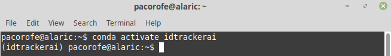

Installation and requirements
=============================

Requirements
------------
idtracker.ai v3 has been tested in computers with the following specifications:

- Operating system: 64bit GNU/linux Mint 19.1 and Ubuntu 18.4
- CPU: Core(TM) i7-7700K CPU @4.20GHz 6 core Intel(R) or Core(TM) i7-6800K CPU @3.40GHz 4 core
- GPU: Nvidia TITAN X or GeForce GTX 1080 Ti
- RAM: 32Gb-128Gb.
- Disk: 1TB SSD

idtracker.ai is coded in python 3.6 and uses Tensorflow libraries
(version 1.13). Due to the intense use of deep neural networks, we recommend using a computer with a dedicated NVIDA GPU supporting compute capability 3.0 or higher. Note that the parts of the algorithm using Tensorflow libraries will run faster with a GPU.

Pre-installation checks
-----------------------

**Install NVIDIA drivers +410.38 (for the installation with GPU support)**
~~~~~~~~~~~~~~~~~~~~~~~~~~~~~~~~~~~~~~~~~~~~~~~~~~~~~~~~~~~~~~~~~~~~~~~~~~

Install idtracker.ai with GPU support in your computer if you want to track videos keeping the identities of each animal. Note that idtracker.ai allows users to track single animals and to track groups of animals without keeping the identity. For these cases you do not need GPU support (see the Option 3 in the installation instructions below).

idtracker.ai has been currently tested on Tensorflow 1.13. This version of Tensorflow requires the CUDA 10.0 which requires an NVIDIA driver version >= 410.38 (see `cuda compatiblity <https://docs.nvidia.com/deploy/cuda-compatibility/>`). Below we give instructions to check your NVIDIA driver version and how to install a compatible version with Cuda 10.0.

**For Linux users**
*******************

To check whether the NVIDIA drivers are correctly installed in your computer, open a terminal and type

.. code-block:: bash

    nvidia-smi

You should get an output similar to this one

.. code-block:: bash

    Fri Jul 26 14:10:04 2019
    +-----------------------------------------------------------------------------+
    | NVIDIA-SMI 430.26       Driver Version: 430.26       CUDA Version: 10.2     |
    |-------------------------------+----------------------+----------------------+
    | GPU  Name        Persistence-M| Bus-Id        Disp.A | Volatile Uncorr. ECC |
    | Fan  Temp  Perf  Pwr:Usage/Cap|         Memory-Usage | GPU-Util  Compute M. |
    |===============================+======================+======================|
    |   0  GeForce GTX TIT...  Off  | 00000000:01:00.0  On |                  N/A |
    | 34%   77C    P2   157W / 250W |  11958MiB / 12211MiB |     57%      Default |
    +-------------------------------+----------------------+----------------------+

    +-----------------------------------------------------------------------------+
    | Processes:                                                       GPU Memory |
    |  GPU       PID   Type   Process name                             Usage      |
    |=============================================================================|
    |    0       952      G   /usr/lib/xorg/Xorg                           119MiB |
    |    0      2211      C   .../miniconda3/envs/idtrackerai/bin/python 11748MiB |
    |    0      5900      G   ...-supports-dual-gpus=false --gpu-driver-    77MiB |
    +-----------------------------------------------------------------------------+

Check that in the part where it says "Driver Version" you have value higher than 410.38.

If you fail to get this output or your version is smaller than 410.38, then follow these steps (adapted and summarized from `this page <https://www.mvps.net/docs/install-nvidia-drivers-ubuntu-18-04-lts-bionic-beaver-linux/>`_):

1. Clean the system of other Nvidia drivers

.. code-block:: bash

    sudo apt-get purge nvidia*

2. Check the latest driver version for your NVIDIA GPU in `this link <https://www.nvidia.com/object/unix.html>`_.

3. Check if your graphic card is compatible with the `drivers present in the PPA homepage <https://launchpad.net/~graphics-drivers/+archive/ubuntu/ppa>`_.

4. Prepare the system for the installation.

.. code-block:: bash

    sudo apt-get update
    sudo apt-get install screen
    screen

5. Install the NVIDIA GPU driver. In the following command, substitute the XXX by the number of the driver you want to install (e.g. *nvidia-driver-410*).

.. code-block:: bash

    sudo apt-get install nvidia-driver-XXX

6. Reboot the system.

.. code-block:: bash

    sudo reboot

7. Check the installation.

.. code-block:: bash

    nvidia-smi

**For Windows users**
*********************

To check which NVIDIA drivers you have installed in your computer following these steps (adapted from `this page <https://www.drivereasy.com/knowledge/how-to-check-nvidia-driver-version-easily/>`_):

1. Right click any empty area on your desktop screen, and select NVIDIA Control Panel.

2. Click System Information (on the bottom left corner) to open the driver information.

3. Check the Driver version in the Details section.

You can download the latest driver available for your GPU from `the NVIDIA webpage <https://www.nvidia.com/Download/index.aspx>`_.

After downloading the *.exe* file, execute it and follow the instructions. After the installation you will be asked to reboot the computer, please do so for the installation to be complete.

**Preparing a Conda environment (for Linux and Windows)**
~~~~~~~~~~~~~~~~~~~~~~~~~~~~~~~~~~~~~~~~~~~~~~~~~~~~~~~~~

It is good practice to install python packages in virtual environments. In particular,
we recommend using Conda virtual environments. Find here the `Conda installation
instructions for Linux, Windows and MacOS <https://docs.conda.io/projects/conda/en/latest/user-guide/install/>`_.

When deciding whether to install Anaconda or Miniconda, you can find some information about the differences
`here <https://stackoverflow.com/questions/45421163/anaconda-vs-miniconda>`_. For simplicity, we recommend
installing Miniconda.

From now on, every time we refer to the *terminal*, Linux users are meant to use the command line and Windows user are meant to use the Anaconda Powershell Prompt that it is installed when installing Miniconda or Anaconda.

To check whether the Conda package manager is installed, you can open a terminal and type

.. code-block:: bash

    conda

if you get the following output

.. code-block:: bash

    conda: command not found

Miniconda is not installed in your system. Follow the instructions in the link above to install it.

Create a Conda environment where idtarcker.ai will be installed.

.. code-block:: bash

    conda create -n idtrackerai python=3.6

You can learn more about managing Conda environments in `this link <https://docs.conda.io/projects/conda/en/latest/user-guide/tasks/manage-environments.html>`_.

Once the Conda environment has been create you should be able to activate it doing

.. code-block:: bash

    conda activate idtrackerai

or

.. code-block:: bash

    source activate idtrackerai.

**Installation**
~~~~~~~~~~~~~~~~

This version can be installed using the Python package manager, PyPI. For an easy
installation in clusters, the application and the graphical user interface (GUI)
can be installed separately. Below we give installation instructions
for the different usage scenarios.

The following commands are to be run inside of the *idtrackerai* conda environment that you just created. You will know that you are in the idtrackerai environment when you see the name "(idtrackerai)" at the beginning of the terminal.

**Option 1 (GUI, GPU support) (NVIDIA drivers >=410.38 already installed)**
********************************************************************************

You can install idtracker.ai with GUI support with the following command

.. code-block:: bash

    pip install idtrackerai[gui]

To get GPU support without having to manually install the CUDA 10.0 and the cuDNN 7.6, you can install Tensorflow with GPU support from the Conda package manager with the following command:

.. code-block:: bash

    conda install tensorflow-gpu=1.13

Conda will install the CUDA 10.0 and cuDNN 7.6 in your Conda environment for you.

**Option 2 (GUI, GPU support) (NVIDIA drivers >=410.38, CUDA 10.0 and cuDNN 7.5.0 already installed)**
*************************************************************************************************

If you prefer to install the CUDA 10.0 and the cuDNN 7.6 in your system, you can [follow these instructions](https://medium.com/better-programming/install-tensorflow-1-13-on-ubuntu-18-04-with-gpu-support-239b36d29070) until step 6.

Then, you can install idtracker.ai with GUI an GPU support running the command:

.. code-block:: bash

    pip install idtrackerai[gui,gpu]

This command will install Tensorflow 1.13.1 with GPU support.

**Option 3 (GUI, no-GPU support)**
**********************************

In some cases, you might not need the GPU support for idtracker.ai. For example, when tracking single animals, tracking animals without keeping the identities along the video, or when setting the preprocessing parameters to then track the video in a different computer or in a cluster.

In this case, you only need to install idtracker.ai with GUI support with the command

.. code-block:: bash

    pip install idtrackerai[gui]

**Option 4 (no-GUI, GPU support)**
**********************************

You might want to use idtracker.ai from the command line and read the pre-processing parameters from a *.json* file (see instructions to generate a *.json* file in the :doc:`tracking_from_terminal` section). This can be useful if you have a dedicated computer for tracking multiple videos in batches and you access it with SSH, or if your are going to install idtracker.ai in a cluster.

If the CUDA 10.0 and the cuDNN 7.6 are already installed in your computer, you only need to run the following command

.. code-block:: bash

    pip install idtrackerai[gpu]

if you want Conda to install the CUDA 10.0 and cuDNN 7.6 in your Conda environment, then run

.. code-block:: bash

    pip install idtrackerai
    conda install tensorflow-gpu=1.13

**Installation with Docker image**
~~~~~~~~~~~~~~~~~~~~~~~~~~~~~~~~~~

*Coming soon*

**Troubleshooting the installation**
~~~~~~~~~~~~~~~~~~~~~~~~~~~~~~~~~~~~

*coming soon*

**Uninstall and remove the software**
~~~~~~~~~~~~~~~~~~~~~~~~~~~~~~~~~~~~~

As idtracker.ai can be now installed using a PyPI, to uninstall it you just need to execute

.. code-block:: bash

    pip uninstall idtrackerai

If you installed idtracker.ai inside of a Conda environment, you can also remove the environment by doing

.. code-block:: bash

    conda remove -n name-of-the-environment --all
