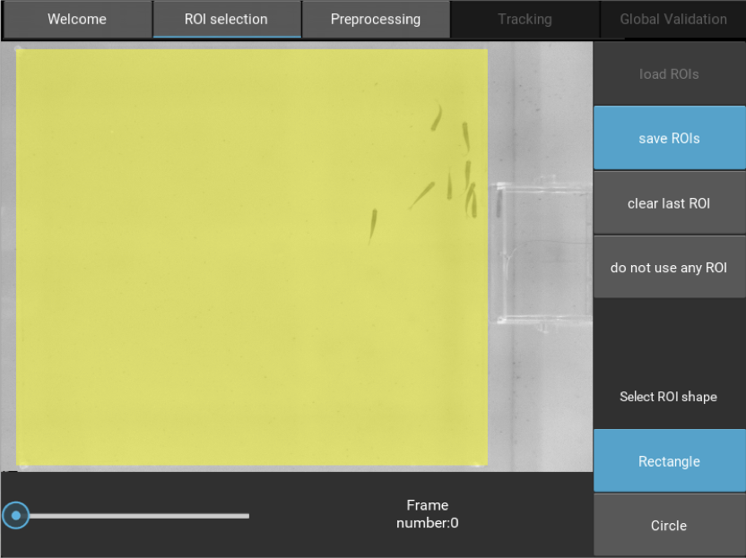
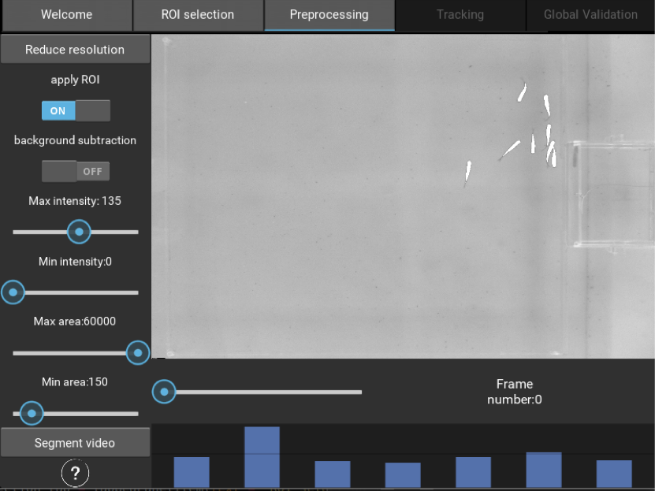
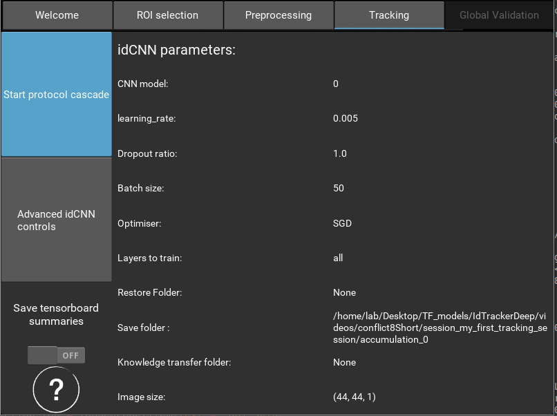
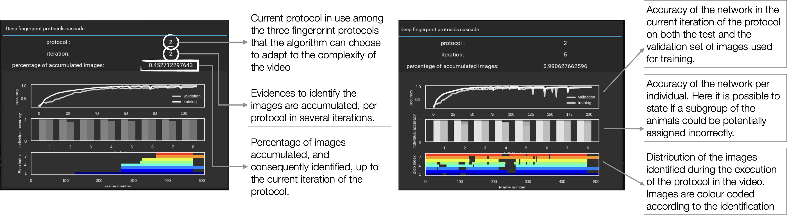
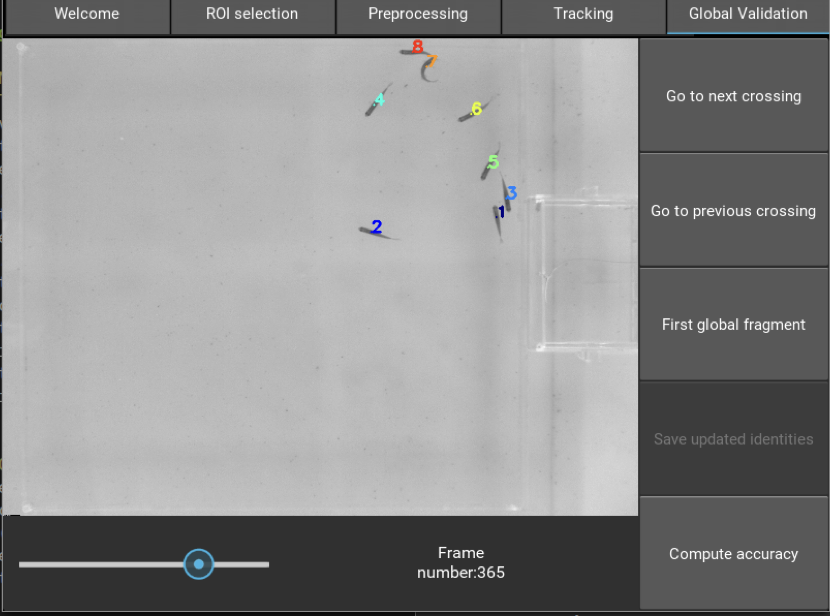

Quickstart
==========

idtrackerai is equipped with a GUI. Start it by double-clicking on the
file created during installation.

If you want to start the GUI from the terminal, open it and type ::

  source activate idtrackerai-environment
  idtrackeraiGUI

^^^^^^^^^^^^^^^^^^^^^^^^^^^^^^^^
Step 1. Start a tracking session
^^^^^^^^^^^^^^^^^^^^^^^^^^^^^^^^

.. figure:: ./_static/img1.png
   :scale: 50 %
   :align: right
   :alt: welcome tab

Browse to the folder containing the video you want to track. The video can either
be a single file or split in separate files. In the latter case, each segment
has to be named following this convention:

  name_of_the_video_segment_number.extension

Click on the video file (or one of its segments) to start a new tracking session.
After clicking on the video file it is necessary to assign a name to the current
tracking session.

.. figure:: ./_static/img2.png
   :scale: 50 %
   :align: center
   :alt: session name

By entering the name of an existing session it will be possible to load all or
part of the processes already computed.

^^^^^^^^^^^^^^^^^^^^^^^^^^^^^^^^^^^^
Step 2. Select a region of interests
^^^^^^^^^^^^^^^^^^^^^^^^^^^^^^^^^^^^

If you don't need to select a region of interest skip this tab by clicking on
the tab preprocessing.

It is possible to select one or more region of interests on the video.
First select the shape of the ROI, then draw it by clicking and dragging
on the frame. In case of mistake it is possible to delete the ROI and draw a new
one. Save the ROI by clicking the button "save ROI" before leaving the tab.
The slider allows to browse the video in order to check the goodness of the
selected ROIs in every frame.

In case you are working on a session in which a ROI had already been created it
is possible to load it by clicking on the button "load ROI"

^^^^^^^^^^^^^^^^^^^^^^^^^^^^^^^^^^^^^^^^^^^^^
Step 3. Video segmentation and preprocessing
^^^^^^^^^^^^^^^^^^^^^^^^^^^^^^^^^^^^^^^^^^^^^

The aim of this step is to set the parameters that allow to separate the animals
from the background. Apply the ROIs selected in the precious step by activating
the “apply ROI” switch. The background can be subtracted by activating the
switch “subtract background”.
The upper and lower bound sliders allow to define a range of admissible
intensities. In the example, since the fish are darker than the background we
consider only pixels whose intensity is greater or equal than 135.
Where the intensity scale ranges between 0 and 255.
Finally the user can set the range of acceptable areas (number of pixels) for
each blob, the bars on the bottom show the area value per detected blob.
After setting the parameters, the segmentation of the video can be initiated by
clicking the button “Segment video”. A popup showing an estimate of the number
of animals present in the video will open. Modify the number if it is incorrect
and press return on your keyboard.
A series of popup will keep you updated with respect to the stage of the preprocessing.

.. figure:: ./_static/img6.png
  :scale: 30 %
  :align: right
  :alt: welcome tab

It is possible that the segmentation will be described as “non consistent”. This
means that in one or more frames the number of blobs detected by the algorithm
is greater than the number of animals present in the video. In this case the
user is asked to readjust the segmentation parameters in those frame. Those
frames will be re-segmented and evaluated until the number of detected blobs
will match the number of animals declared by the user in all the frames.

idtrackerai uses deep learning to discriminate between segmented images
representing single individual and multiple touching animals. A final
preprocessing popup shows the graph of the loss function and the accuracy of
this network, when trained on a dataset automatically extracted from the images
segmented in the previous stages. It is now possible to start the tracking by
closing the popup (click outside its area) and clicking on the tracking tab that
is now active.

^^^^^^^^^^^^^^^^^^^^^^^^^^^^^^^^
Step 4. Start tracking the video
^^^^^^^^^^^^^^^^^^^^^^^^^^^^^^^^

To start the tracking click on the button “Start protocols cascade”.
The values displayed on the right of the tab are the hyperparameters used to
initialise the artificial neural network used to identify the animals. These
parameters can be changed by clicking on the button “Advanced idCNN controls”,
we recommend only advanced users to access this options.
A switch allows to save the training data to be displayed in tensorboard (we
will discuss the output folders structure at the end of this document).

After clicking on the button “Start protocols cascade” a popup will keep you
updated with respect to the state of the algorithm:

After the protocol has been carried out successfully and the trajectories of the
identified animals have been saved a popup allows either to quit the program of
proceed to the validation of the video.
In addition the estimated accuracy of the tracking is shown. The algorithm will
automatically recommend the user to proceed to the validation if the estimated
accuracy is lower than expected.

^^^^^^^^^^^^^^^^^^^^^^^^^^^^^^^^^^^^^^^^^
Step 5. Global and individual validation
^^^^^^^^^^^^^^^^^^^^^^^^^^^^^^^^^^^^^^^^^

The output of the tracking algorithm can be easily validated and corrected by
using the global and validation tabs.
Since the identity of the animals is preserved between crossings, it is possible
to jump from one crossing to the next or the previous by using the “Go to next
(previous) crossing”, or simply using the up and down arrow respectively.
The identification is done starting from a particular part of the video called
“first global fragment”, we suggest to start a validation from that part of the
video that can be reached in any moment by clicking on the button “First global
fragment”.
In case the user modifies at least one of the assigned identities the algorithm
gives the possibility to save the updated identities and update the trajectory
file generated as an output accordingly.
The individual validation allows to follow a single animal along the entire
video. This procedure is particularly useful to evaluate the performance of the
tracking when dealing with large groups of animals.
