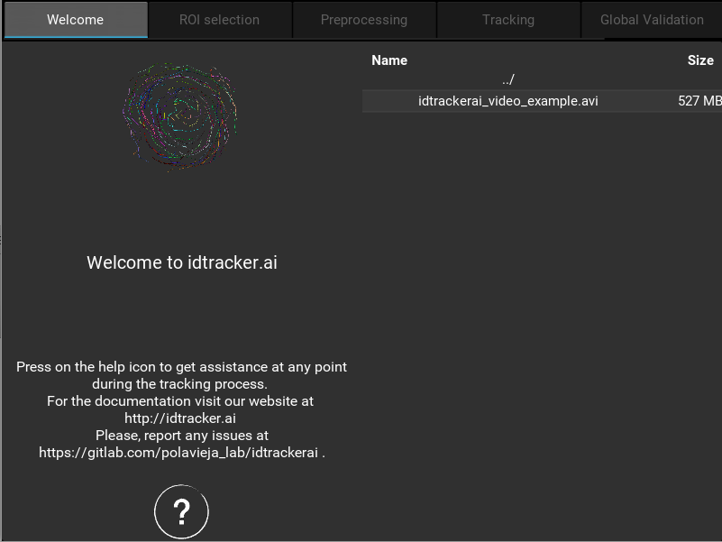
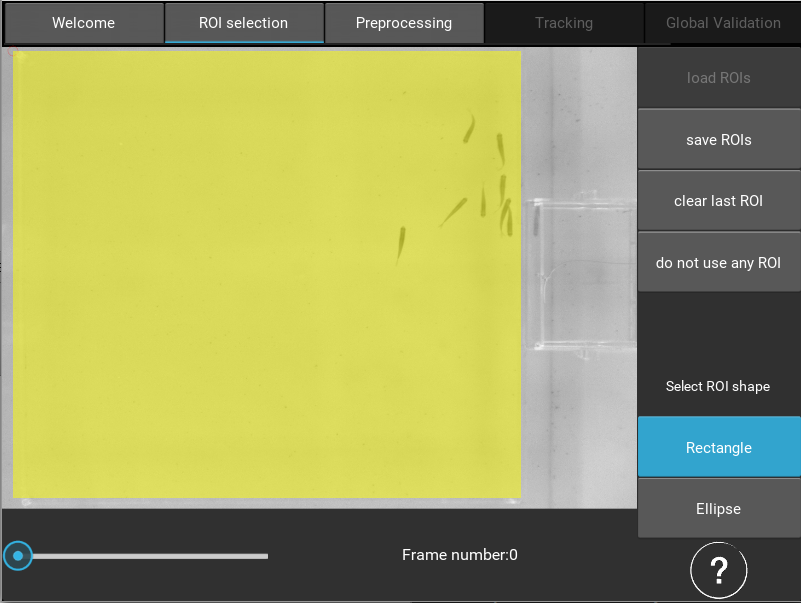
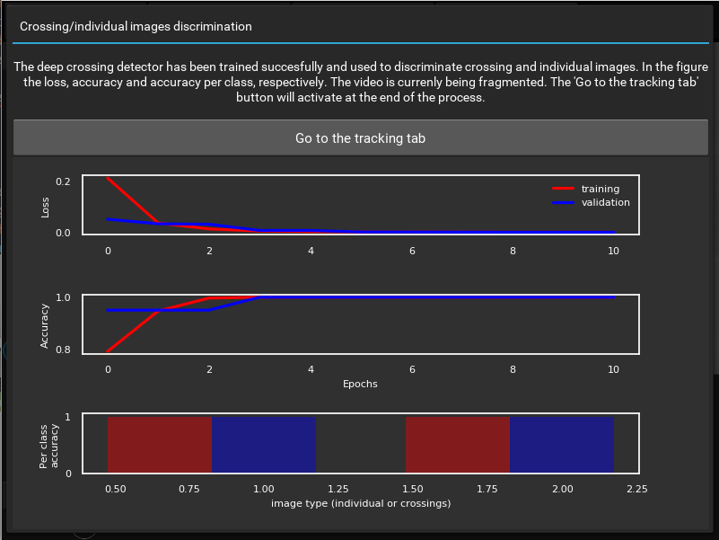
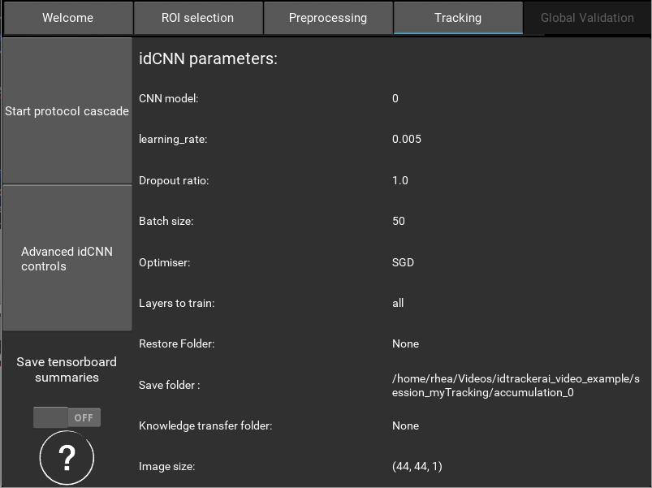

Quickstart
==========

In this section we explain how to start tracking a video with idtracker.ai. For more information about
the different functionalities of the system go to the
:doc:`./GUI_explained` section or check the Supplementary Material in [1]_. Please read the notes in
italics to get advice about how to set the parameters to track the sample videos with
good performance levels.

^^^^^^^^^^^^^^^^^^^^^^^^^^^^^^^^^^
Step 1. Download the video example
^^^^^^^^^^^^^^^^^^^^^^^^^^^^^^^^^^
If it is the first time that you are using this system, we recommend to start with
the video example of 8 adult zebrafish (*Danio rerio*). You can download it from
`this link <https://drive.google.com/open?id=1uBOEMGxrOed8du7J9Rt-dlXdqOyhCpMC>`_.

At the end of this page you will find the link to a video of 100 juvenile zebrafish.
We recommend to start with the video of 8 fish as it is faster to track and it is good
to get use to the system.

^^^^^^^^^^^^^^^^^^^^^^^^^^^^^^^^^^^^^^^^^^
Step 2. Copy video to an adequate location
^^^^^^^^^^^^^^^^^^^^^^^^^^^^^^^^^^^^^^^^^^
Copy the video to a folder where you want the output files to be placed.
Depending on the length of the video, the number of animals, and the number
of pixels per animal, idtracker.ai will generate different amounts of data,
so there must be free space on the disk to allocate the output files.

For a video of :math:`\approx18` sec at :math:`28fps` (:math:`\approx510` frames) with :math:`8` animals
and an average of :math:`334` pixels per animal the system produces :math:`227.4` MB. We recommend
using solid state disks as the saving and loading of the multiple objects that
idtracker.ai generates will be faster.

^^^^^^^^^^^^^^^^^^^^^^^^^^^^^^^^
Step 3. Start a tracking session
^^^^^^^^^^^^^^^^^^^^^^^^^^^^^^^^
idtrackerai is equipped with a GUI organized by tabs that activate to guide the user
throughout the tracking process. Press the help button in any tab to get more information
about the possible actions in the tab.

To start the GUI open a terminal and type

  source activate idtrackerai-environment
  idtrackeraiGUI

After opening the idtracker.ai user interface, browse to the folder containing
the video you want to track (if needed, use the bar with the symbol "../" to go up in
your folders).
In case the video is split in segments, the software will concatenate them if
each segment is named according to the following convention:

    videoName_segmentNumber.extension

Click on the video file (or one of its segments) to start a new tracking session.
After clicking on the video file it is necessary to assign a name to the current
tracking session. Type a name and press ENTER.

By entering the name of an existing session it will be possible to load all or
part of the processes already computed. Note that the word "session" is
included by default in the name, so if your session name is "newTracking" the
session folder generated will be:

    session_newTracking

^^^^^^^^^^^^^^^^^^^^^^^^^^^^^^^^^^^^
Step 4. Select a region of interests
^^^^^^^^^^^^^^^^^^^^^^^^^^^^^^^^^^^^
If needed, it is possible to select one or more ROIs to limit the tracking to a
portion of each frame of the video or to prevent objects to be detected.

First select the shape of the ROI: It is possible to draw either rectangular or
elliptic ROIs. To draw a rectangle, first click on the position of one of the
corners of the rectangle and then, without dragging, on the position of the opposite corner.
To generate a elliptical ROI select 5 points on the contour of the ellipse that
you want to draw.

In case of mistake it is possible to delete the ROI and draw a new one. Furthermore,
it is possible to draw as many ROIs as desired. The slider allows to browse the
video in order to check the goodness of the selected ROIs in every frame. Finally,
save the ROI by clicking the button “save ROI” before leaving the tab.

If you don't need to select a region of interest skip this tab by clicking on
the tab preprocessing.

*NOTE 1: To track the video of 8 adult zebrafish you do not actually need a ROI. However
you can try selecting a rectangular ROI. Remember to check whether all the fish are inside
of the ROI for the whole part of the video, otherwise the tracking can give bad results*.

*NOTE 2: To track the video of 100 juvenile zebrafish we recommend using a circular (ellipse)
ROI. Use the track bar to explore where the animals move in the frame. The limit of the
swimming area is the biggest ring that is completely included in the frame.*

^^^^^^^^^^^^^^^^^^^^^^^^^^^^^^^^^^^^^^^^^^^^^
Step 5. Video segmentation and preprocessing
^^^^^^^^^^^^^^^^^^^^^^^^^^^^^^^^^^^^^^^^^^^^^

The aim of this step is to set the parameters that allow to separate the animals
from the background.

Apply the ROIs selected in the previous step by activating the “apply ROI” switch.
The minimum and maximum threshold sliders allow to define a range of admissible
intensities. In the example, since the fish are darker than the background,
we consider only pixels whose intensity is greater or equal than :math:`135`.
The intensity ranges from :math:`0` to :math:`255`.

We call a collection of connected pixels that satisfies the intensity thresholds a blob.
The user can set the range of acceptable areas (number of pixels) of the segmented blobs.
This allows to exclude noisy blobs, or bigger objects that do not correspond
to animals, despite their intensity. The bars plot on the bottom displays the
areas of the detected objects in the current frame. A horizontal line indicates
the minimum of the areas of the segmented blobs.

Use the track bar to explore the video and check that all the animals are segmented
properly in different areas of the frame. An adequate set of the preprocessing parameters
is a key point to obtain a good performance of the following steps.

After setting the parameters, the segmentation of the video can be initiated by
clicking the button “Segment video”. A popup showing an estimate of the number
of animals present in the video will open. Modify the number if it is incorrect
and press return on your keyboard. A series of popups will keep you updated about
the stage of the preprocessing.

idtracker.ai uses deep learning to discriminate between segmented images
representing single individuals and multiple touching animals. A final preprocessing
popup shows the graph of the loss function and the accuracy of this network,
when trained on a dataset automatically extracted from the images segmented in
the previous stages. It is now possible to start the tracking by clicking on
the bar that says "Go to the tracking tab".

*NOTE 1: We recommend the following set of parameters for a good tracking performance
on the sample video of 8 zebrafish:*

- *apply ROI: OFF*
- *background subtraction: OFF*
- *check segmentation consistency: OFF*
- *Max intensity: 135*
- *Min intensity: 0*
- *Max area: 60000*
- *Min area: 150*

*NOTE 2: We recommend the following set of parameters for a good tracking performance
on the sample video of 100 zebrafish:*

- *apply ROI: ON (circular ROI)*
- *background subtraction: ON*
- *check segmentation consistency: OFF*
- *Max intensity: 216*
- *Min intensity: 0*
- *Max area: 60000*
- *Min area: 100*

^^^^^^^^^^^^^^^^^^^^^^^^^^^^^^^^
Step 6. Start tracking the video
^^^^^^^^^^^^^^^^^^^^^^^^^^^^^^^^

To start the tracking click on the button “Start protocol cascade”. The values
displayed on the right of the tab are the hyperparameters used to initialise
the artificial neural network used to identify the animals. These parameters
can be changed by clicking on the button “Advanced idCNN controls”, we recommend
only advanced users to access this options. After clicking on the button
“Start protocol cascade” a popup will keep you updated about the state of
the algorithm.

.. figure:: ./_static/qs_img8.png
   :scale: 20 %
   :align: center
   :alt: welcome tab

After the protocol has been carried out successfully and the trajectories of
the identified animals have been saved a popup allows either to quit the program
or proceed to the validation of the video. In addition, the estimated accuracy
of the tracking is shown. The algorithm will automatically recommend the user
to proceed to the validation if the estimated accuracy is lower than expected.

Choose to validate the trajectories "with animals not identified during crossings"
if you want to check the trajectories of individual animals before and after
they touch or cross with other animals. Choose to validate the trajectories
"with animals identified during crossings" if you want to check the trajectories also
when animals touch or cross.

^^^^^^^^^^^^^^^^^^^^^^^^^^^^^^^^^^^^^^^^
Step 7. Global and individual validation
^^^^^^^^^^^^^^^^^^^^^^^^^^^^^^^^^^^^^^^^

.. figure:: ./_static/qs_img9.png
   :scale: 50 %
   :align: right
   :alt: welcome tab

The output of the tracking algorithm can be easily validated and corrected by
using the global validation and individual validation tabs.

Since the identity of the animals is preserved between crossings, it is possible
to jump from one crossing to the next or the previous by using the “Go to next
(previous) crossing” button, or by pressing the up and down arrow on the keyboard.

The identification of the individual is done starting from a particular part of
the video called “first global fragment”. We suggest to start a validation from
this part of the video which can be reached in any moment by clicking on the
button “First global fragment”.

To modify the identity of an individual click inside of the body of the animal.
A pop up will appear indicating the current identity of the animal. Type the new
identity and press return. The new identity will be propagated to the past and
the future until the animal enters a crossing or disappears. In case the user
modifies at least one of the assigned identities the algorithm gives the possibility
to save the updated identities and updates the file were all the information about
the blobs is stored.

^^^^^^^^^^^^^^^^^^^^
Step 8. Output files
^^^^^^^^^^^^^^^^^^^^

The files generated during the tracking and the files with the trajectories
are stored in the session folder. The trajectories of the animals in the parts
where they are not crossing can be found in the folder "trajectories". The
trajectories with the interpolated position of the animals during the crossings
can be found in the folder "trajectories_wo_gaps".

.. figure:: ./_static/session_folder.png
   :scale: 80 %
   :align: center
   :alt: welcome tab

.. [1] Romero-Ferrero, F., Bergomi, M.G., Hinz, R.C., Heras, F.J.H., de Polavieja, G.G., (2018).
   idtracker.ai: Tracking unmarked individuals in large collectives (submitted)
   (R-F.,F. and B.,M.G. contributed equally to this work.)

^^^^^^^^^^^^^^^^^^^^^^^^^^^^^^^^^^
Try the 100 zebrafish sample video
^^^^^^^^^^^^^^^^^^^^^^^^^^^^^^^^^^

You can download the video from `this link <https://drive.google.com/open?id=1Tl64CHrQoc05PDElHvYGzjqtybQc4g37>`_.
Note that the size of this video is 22.4GB, so it should take around 30 minutes to download it at
an average rate of 12Mb/s.

To track this video we recommend using a computer with similar specifications to the ones
listed in the :doc:`./how_to_install`. In particular, we successfully tracked this video in about 3 hours
in a computer with 8 cores, 32Gb of RAM, a Titan X GPU and a 1 Tb SSD.

WARNING: Trying to track this video in a computer with less than 32Gb of RAM might block your computer.

Due to the higher frame size of this video (3500x3584) you might notice a decrease of
speed when adjusting the preprocessing parameters.
