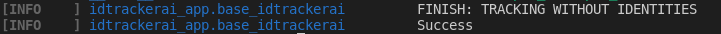
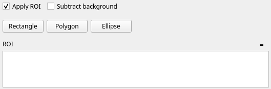

Quickstart
==========

In this page we explain how to start tracking a video with idtracker.ai v4. 
For more information about the different functionalities of this new version 
visit the pages :doc:`./GUI_explained`, :doc:`tracking_from_terminal` and 
:doc:`advanced_parameters`.

The full process of tracking this example video takes around 5-7 minutes in
 one of our computers (:doc:`./requirements`). 
 The time varies with the amount of interaction with the GUI 
 that the user needs to explore the video and set the parameters and the 
 advanced settings `SAVE_PIXELS` and `SAVE_SEGMENTATION_IMAG` 
 (see :doc:`advanced_parameters`).

^^^^^^^^^^^^^^^^^^^^^^^^^^^^
Step 0. Install idtracker.ai
^^^^^^^^^^^^^^^^^^^^^^^^^^^^
If you haven't installed the software yet, go to the :doc:`how_to_install` 
page where you will find the installation instructions.

^^^^^^^^^^^^^^^^^^^^^^^^^^^^^
Step 1. Test the installation
^^^^^^^^^^^^^^^^^^^^^^^^^^^^^
Open a terminal (Anaconda Prompt in Windows) and activate the Conda 
environment where you installed idtracker.ai.

.. code-block:: bash

    conda activate name_of_the_environment

If you don't remember the name of the environment, you can type:

.. code-block:: bash

    conda info --envs

to list all the environment in your computer.

Run the command:

.. code-block:: bash

    idtrackerai_test

This command will download a small example video and will execute idtracker.ai 
with default parameters.

By default this command will use an example video that is a subfolder 
called `idtrackerai/data` in the same folder where idtracker.ai is installed. 
If you want to download the video and save the results of the tracking in a 
different folder you can run the command:

.. code-block:: bash

    idtrackerai_test -o absolute/path/to/the/save_folder

where you should substitute the *absolute/path/to/the/save_folder* with the 
path of the folder where you want the data to be downloaded and saved.

In an installation with GPU support the test took around 6 minutes in our 
computers In an installation with no-GPU support the test took 37 minutes in 
our computers. At the end of the test, the terminal should have an 
output similar to this one:

.. figure:: ./_static/quickstart/output_test.png
   :scale: 80 %
   :align: center
   :alt: output_test

If you installed idtracker.ai without GPU support and you don't want to wait 
so long, you can run the following command:

.. code-block:: bash

    idtrackerai_test -o absolute/path/to/the/save_folder --no_identities

This will run the test but it will skip the part of the algorithm that uses 
the GPU to train the convolutional neural networks to identify the animals.

In our computers this test took 2 minutes. The terminal at the end of the 
process should look like this one:

^^^^^^^^^^^^^^^^^^^^^^^^^^^^^^^^^^
Step 2. Download the video example
^^^^^^^^^^^^^^^^^^^^^^^^^^^^^^^^^^
If this is the first time that you are using this system, we recommend to 
start with the video example of 8 adult zebrafish (*Danio rerio*). If you 
have already run the test giving a specific folder to save the results, you 
already have the example video to start. Otherwise, you can download it from 
`this link <https://drive.google.com/open?id=1uBOEMGxrOed8du7J9Rt-dlXdqOyhCpMC>`_.

At the end of this page you will find the link to a video of 100 juvenile 
zebrafish. We recommend to start with the video of 8 fish as it is faster 
to track and it is good to get use to the system.

^^^^^^^^^^^^^^^^^^^^^^^^^^^^^^^^^^^^^^^^^^^^^^
Step 3. Copy the video to an adequate location
^^^^^^^^^^^^^^^^^^^^^^^^^^^^^^^^^^^^^^^^^^^^^^
Copy the video to a folder where you want the output files to be placed. 
Depending on the length of the video, the number of animals, and the number 
of pixels per animal, idtracker.ai will generate different amounts of data, 
so there must be enough free space on the disk to allocate the output files. 
We recommend using solid state disks (SSD) as the saving and loading of the 
multiple objects that idtracker.ai generates will be faster.

^^^^^^^^^^^^^^^^^^^^^^^^^^^^^^^^^^^^^^^^^^^^^^^^^^^
Step 4. Launch the idtrackerai GUI and open a video
^^^^^^^^^^^^^^^^^^^^^^^^^^^^^^^^^^^^^^^^^^^^^^^^^^^
The next steps will assume that you installed idtrackerai with GUI support. 
Check the :doc:`how_to_install` page for the installation instructions.

To launch the GUI open a terminal, activate the Conda environment where you 
installed idtracker.ai and run the command

.. code-block:: bash

  idtrackerai

After opening the idtracker.ai user interface, click the button *Open* and 
browse to the folder where you saved the example video and double click to 
open it.

Press the "PLAY" button to visualize the video and see how the preprocessing 
parameters affect the different frames in the video. Use the "PAUSE" button 
to pause the video. Scroll up/down on top of the preview window to zoom 
out/in in the frame. Press any number from 1-9 to fast forward the video. 
Scroll up/down on top of the box indicating the frame number to 
increase/drecrease the frame number. You can explore any frame by typing the 
number inside of the box. Drag the gray square in the track bar to move to 
different frames in the video.

^^^^^^^^^^^^^^^^^^^^^^^^^^^^^^^^^^^^^^^^
Step 5. Set the preprocessing parameters
^^^^^^^^^^^^^^^^^^^^^^^^^^^^^^^^^^^^^^^^

*NOTE: The default values of the parameters that appear in the window ensure 
a good tracking performance for this video. Modifying them might imply a 
decrease on the tracking performance*

It is very important for idtracker.ai to know the number of animals 
to be tracked. Make sure that the value in the box **Number of animals**
is equal to the number of animals that appear in the video (8 in this case). 
For a good performance of the algorithm, there must be multiple parts in the
video where the number of blobs detected (marked in red in the preview window) 
is equal to the **Number of animals** indicated in this text box.

You can get more information about the number of blobs detected by checking 
the option **Segmented blobs info**. Toggling this box will show a graph like 
this one:

.. figure:: ./_static/quickstart/area_graph.png
   :scale: 100 %
   :align: center
   :alt: area graph

If you only see a white window, move to a different frame for the graph to 
update the graph.

The title of the graph indicates the the number of blobs detected, together 
with the area of the smallest blob. In the graph, each bar indicates the area 
in pixels of each of the detected blobs. The horizontal gray line indicates the 
minimum area.

Check the :doc:`./GUI_explained` section to get more information about the 
**Check segmentation** option.

There are four main parameters that affect the number of blobs detected in a 
given frame. The **Intensity thresholds** (minimum and maximum) and the 
**Area thresholds** (minimum and maximum). Connected pixels which intensity 
values are within the range defined by the intensity thresholds will be 
detected as a blob if the number of pixels that define the blob (the area of 
the blob) is within of the range defined by the area thresholds.

To modify the different thresholds, you can type the new value inside of the 
text box, scroll up/down with the cursor placed on top of the box, or drag 
the extremes of the blue bars.

Check the :doc:`./GUI_explained` section to get more information about the 
**Subtract background** box and the **Resolution reduction** parameter.

Sometimes you might want to discard the beginning or the end of a video. 
You can do this by setting the starting and ending frames of the 
**Tracking interval**.

Check the :doc:`./GUI_explained` section to get more information about the 
**Multiple** box that will allow you to set multiple tracking intervals.

^^^^^^^^^^^^^^^^^^^^^^^^^^^^^^^^
Step 6. Set a region of interest
^^^^^^^^^^^^^^^^^^^^^^^^^^^^^^^^

In the example video, the animals can be easily separated from the background 
using only the **Intensity thresholds** and the **Area thresholds**. However, 
it can happen that there are other detected blobs in the frame that do not 
correspond to any animal (e.g. reflections, parts of the experimental rig,...). 
If these objects appear consistently in a part of the frame where the animals 
do not appear, you can mask the objects by setting one or multiple regions of 
interest (ROI).

Toggle the box **Apply ROI**. Three buttons and a white box will appear below.

Click on the **Rectangle** button. Then, in the preview window, click on one 
of the corners of the rectangle that you want to draw and drag to the position 
of the opposite corner. This should draw a green rectangle.

Only the pixels inside of the ROI will be considered when applying the 
**Intensity thresholds** and the **Area thresholds**. To delete the ROI, 
click on the list of points created in the white box. They will highlight 
in blue. Then click the minus sign (-) button on the top right of the box to 
delete it. If you do not want to apply any ROI, uncheck the **Apply ROI** box.

Check the :doc:`./GUI_explained` section to get more information about how to 
draw **Polygons** and **Ellipses**.

*NOTE: To track the example video with good performance results you don't need 
to set any ROI*

^^^^^^^^^^^^^^^^^^^^^^^^^^^^^^^^^^^^^^^^^^^^^^^^^^^^^^^^^
Step 7. Set the session name and start tracking the video
^^^^^^^^^^^^^^^^^^^^^^^^^^^^^^^^^^^^^^^^^^^^^^^^^^^^^^^^^

Before pressing the **Track video** button, add the name of the tracking 
session in the top right *Session* text box. The results of the tracking will 
be saved in a folder with the name "Session_sessionname" where "sessionname" 
will be the text that appear in the *Session* text box.

idtracker.ai allows the user to save the preprocessing parameters as they 
appear in the main window. This can be done with the **Save parameters** 
button. Saving the preprocessing parameters is useful to track the video 
later from the command line. Check the :doc:`tracking_from_terminal.rst` 
section to get more information about how to save the parameters and track 
multiple videos sequentially.

For now, click the **Track video** button to start tracking the video. The 
system will compute the different steps necessary to track the video and the 
**Progress** bar will advance accordingly. Note that no feedback is given to 
the user in the form of windows or graphs. You can check the progress
of the tracking in the terminal.

In Linux you use the commands

.. code-block:: bash

    top

or

.. code-block:: bash

    htop

to monitor the CPU and memory usage. And the command

.. code-block:: bash

    watch -n -1 nvidia-smi

to monitor the GPU usage.

In Windows you can check Windows System Resource Manager.

At the end of the tracking, a window will pop up showing that the tracking 
has finished and the estimated accuracy. Also, the terminal will show a 
message indicating the estimated accuracy and the value of the DATA_POLICY 
advanced parameter (see :doc:`advanced_parameters`).

.. figure:: ./_static/quickstart/output_test.png
   :scale: 100 %
   :align: right
   :alt: finished terminal

Check the :doc:`./GUI_explained` section to get more information about the 
effects of toggling the box *Track without identities*.

Check the :doc:`./advanced_parameters` section to get more information about 
how to change some advanced parameters of the algorithm.

^^^^^^^^^^^^^^^^^^^^^^^^^^^^^^^^^
Step 8. Validate the trajectories
^^^^^^^^^^^^^^^^^^^^^^^^^^^^^^^^^

Once the tracking has finished, the button **Validate trajectories** will 
activate. This button will open a new window that will show the results of 
the tracking for every frame of the video. You will be able to correct the 
identities of the animals that were misidentified and to change the position 
of the centroids of individual and crossing animals.

Check the instructions of the validation GUI in :doc:`./validation_GUI.rst` 
page.

^^^^^^^^^^^^^^^^^^^^
Step 9. Output files
^^^^^^^^^^^^^^^^^^^^
The data generated during the tracking process and the trajectories files are 
stored in the session folder. If the name of the session was "quickstart" the 
name of the folder will be "Session_quickstart". Depending on the value of the 
DATA_POLICY advanced parameter (see :doc:`./advanced_parameters`), the content 
of the session folder will vary. In this case, the content of the folder 
should be similar to this one.

The trajectories are stored in the subfolders "trajectories" and 
"trajectories_wo_gaps". The "trajectories.npy" file contains the trajectories 
with gaps (NaN) when the animals were touching or crossing. 
The "trajectories_wo_gaps.npy" file contains the trajectories with the 
gaps interpolated. There might still be some gaps where the interpolation 
was not consistent.

Check the :doc:`trajectories_analysis` section to learn more about how to 
load and analyze the trajectories generated with idtracker.ai.

^^^^^^^^^^^^^^^^^^^^^^^^^^^^^^^^^^
Try the 100 zebrafish sample video
^^^^^^^^^^^^^^^^^^^^^^^^^^^^^^^^^^

You can download the video from 
`this other link <https://drive.google.com/open?id=1Tl64CHrQoc05PDElHvYGzjqtybQc4g37>`_. 
Note that the size of this video is 22.4GB, so it 
should take around 30 minutes to download it at an average rate of 
12Mb/s.

Due to the higher frame size of this video (3500x3584) you might notice a 
decrease of speed when adjusting the preprocessing parameters.

**Tracking time and preprocessing parameters...**
