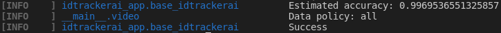

Quickstart
==========

In this section we explain how to start tracking a video with idtracker.ai v3. For more information about
the different functionalities of the system go to the :doc:`./GUI_explained` section. Please read the notes in
italics to get advice about how to set the parameters to track the sample videos with
good performance levels.

The full process of tracking this sample video takes around 5-7 minutes in one of our computers (:doc:`./requirements`).
The time varies with the amount of interaction with the GUI that the user needs to explore the video and set the parameters.

^^^^^^^^^^^^^^^^^^^^^^^^^^^^
Step 0. Install idtracker.ai
^^^^^^^^^^^^^^^^^^^^^^^^^^^^
If you haven't installed the software yet, got to the `gitlab repository <https://gitlab.com/polavieja_lab/idtrackerai>`_
where you will find the instructions to install it in both Windows and Linux computers.

^^^^^^^^^^^^^^^^^^^^^^^^^^^^^
Step 1. Test the installation
^^^^^^^^^^^^^^^^^^^^^^^^^^^^^
Open a terminal (Anaconda Prompt in Windows) and activate the Conda environment
where you installed idtracker.ai. Run the command:

    idtrackerai_test

This command will download a small example video and will execute idtracker.ai
with default parameters.

By default the test downloads the video in a folder called */data* where idtracker.ai
is installed. If you want to download the video and save the results of the tracking
in a different folder you can run the command:

    idtrackerai_test -o absolute/path/to/the/save_folder

where you should substitute the *absolute/path/to/the/save_folder* with the path
of the folder where you want the data to be downloaded and saved.

In an installation with GPU support the test took around 6 minutes in our computers
with a download speed of 45.7MB/s.
In an installation without GPU support the test took 37 minutes in our computers
with a download speed of 28.6MB/s.
At the end of the test, the terminal should have an output similar to this one:

If you installed idtracker.ai without GPU support and you don't want to wait so long,
you can run the following command:

    idtrackerai_test -o absolute/path/to/the/save_folder --no_identities

This will run the test but it will skip the part of the algorithm that uses the GPU
to train the convolutional neural networks to identify the animals.

In our computers  this test took 2 minutes. The terminal at the end of the process
should look like this one:

.. figure:: ./_static/quickstart/output_test_no_ids.png
   :scale: 80 %
   :align: center
   :alt: output_test

^^^^^^^^^^^^^^^^^^^^^^^^^^^^^^^^^^
Step 2. Download the video example
^^^^^^^^^^^^^^^^^^^^^^^^^^^^^^^^^^
If it is the first time that you are using this system, we recommend to start with
the video example of 8 adult zebrafish (*Danio rerio*). If you run the test giving a
specific folder to save the results, you already have the example video to start.
Otherwise, you can download it from `this link <https://drive.google.com/open?id=1uBOEMGxrOed8du7J9Rt-dlXdqOyhCpMC>`_.

At the end of this page you will find the link to a video of 100 juvenile zebrafish.
We recommend to start with the video of 8 fish as it is faster to track and it is good
to get use to the system.

^^^^^^^^^^^^^^^^^^^^^^^^^^^^^^^^^^^^^^^^^^^^^^
Step 3. Copy the video to an adequate location
^^^^^^^^^^^^^^^^^^^^^^^^^^^^^^^^^^^^^^^^^^^^^^
Copy the video to a folder where you want the output files to be placed.
Depending on the length of the video, the number of animals, and the number
of pixels per animal, idtracker.ai will generate different amounts of data,
so there must be free space on the disk to allocate the output files.

For a video of :math:`\approx18` sec at :math:`28fps` (:math:`\approx510` frames) with :math:`8` animals
and an average of :math:`334` pixels per animal the system produces :math:`227.4` MB. We recommend
using solid state disks as the saving and loading of the multiple objects that
idtracker.ai generates will be faster.

^^^^^^^^^^^^^^^^^^^^^^^^^^^^^^^^^^^^^^^^^^^^^^^^^^^
Step 3. Launch the idtrackerai GUI and open a video
^^^^^^^^^^^^^^^^^^^^^^^^^^^^^^^^^^^^^^^^^^^^^^^^^^^
The next steps will assume that you installed idtrackerai with GUI support.

To start the GUI open a terminal, activate the Conda environment where you
installed idtracker.ai and run the command

  idtrackerai

.. figure:: ./_static/quickstart/idtrackerai_init.png
   :scale: 80 %
   :align: right
   :alt: idtrackerai init

After opening the idtracker.ai user interface, click the button *Open* and browse
to the folder where you saved the example video and double click to open it.

Press the *PLAY* button to visualize the video and see how the preprocessing
parameters affect the different frames in the video. Use the *PAUSE* button to pause the video.
Scroll up/down on top of the preview windows to zoom out/in in the frame.
Press any number from 1-9 to fast forward the video. Scroll up/down on top of
the box indicating the frame number to increase/drecrease the
frame number. You can explore any frame by typing the number inside of the box.
Drag the gray square in the track bar to move to different frames in the video.

^^^^^^^^^^^^^^^^^^^^^^^^^^^^^^^^^^^^^^^^
Step 4. Set the preprocessing parameters
^^^^^^^^^^^^^^^^^^^^^^^^^^^^^^^^^^^^^^^^

^^^^^^^^^^^^^^^^^^^^^^^^^^^^^^^^
Step 5. Set a region of interest
^^^^^^^^^^^^^^^^^^^^^^^^^^^^^^^^

^^^^^^^^^^^^^^^^^^^^^^^^^^^^^^^^
Step 6. Start tracking the video
^^^^^^^^^^^^^^^^^^^^^^^^^^^^^^^^

^^^^^^^^^^^^^^^^^^^^^^^^^^^^^^^^^
Step 7. Validate the trajectories
^^^^^^^^^^^^^^^^^^^^^^^^^^^^^^^^^

^^^^^^^^^^^^^^^^^^^^
Step 8. Output files
^^^^^^^^^^^^^^^^^^^^
 

^^^^^^^^^^^^^^^^^^^^^^^^^^^^^^^^^^
Try the 100 zebrafish sample video
^^^^^^^^^^^^^^^^^^^^^^^^^^^^^^^^^^

You can download the video from `this link <https://drive.google.com/open?id=1Tl64CHrQoc05PDElHvYGzjqtybQc4g37>`_.
Note that the size of this video is 22.4GB, so it should take around 30 minutes to download it at
an average rate of 12Mb/s.

To track this video we recommend using a computer with similar specifications to the ones
listed in the :doc:`./how_to_install`. In particular, we successfully tracked this video in about 3 hours
in a computer with 8 cores, 32Gb of RAM, a Titan X GPU and a 1 Tb SSD.

WARNING: Trying to track this video in a computer with less than 32Gb of RAM might block your computer.

Due to the higher frame size of this video (3500x3584) you might notice a decrease of
speed when adjusting the preprocessing parameters.
