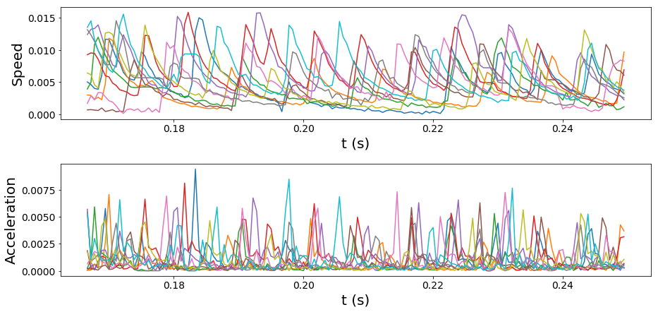

Jupyter Notebooks for analysis
==============================

We are constantly developing new tools to analyze the trajectories that idtracker.ai outputs. We provide Jupyter Notebooks with examples of analysis routines for groups of animals.

^^^^^^^^^^^^^^^^^^^^^^^^^^^^^^^^^^^
The *trajectorytools* python module
^^^^^^^^^^^^^^^^^^^^^^^^^^^^^^^^^^^

You can install the *trajectorytools* module from the following GitHub repository:
https://github.com/fjhheras/trajectorytools

^^^^^^^^^^^^^^^^^
Jupyter Notebooks
^^^^^^^^^^^^^^^^^

You can find some analysis routines from [1]_ implemented with the *trajectorytools* module in the Jupyter Lab Notebook *trajcetoroies.ipynb* in the following GitLab repository: https://gitlab.com/polavieja_lab/idtrackerai_notebooks.

Figures generated from our Jupyter Notebooks for a video of 10 juvenile fish
****************************************************************************

Smoothed trajectories
---------------------

.. image:: _static/trajectories.png

Velocities and accelerations
----------------------------

Density of neighbours around a focal fish
-----------------------------------------

Polar distributions of positions, turnings and accelerations
------------------------------------------------------------

.. image:: _static/polar_plots.png

Inter-individual distance histograms compared with shuffled trajectories
------------------------------------------------------------------------

.. image:: _static/distances_vs_random.png

.. [1] Hinz, R. C., & de Polavieja, G. G. (2017). Ontogeny of collective behavior reveals a simple attraction rule. *Proceedings of the National Academy of Sciences*
