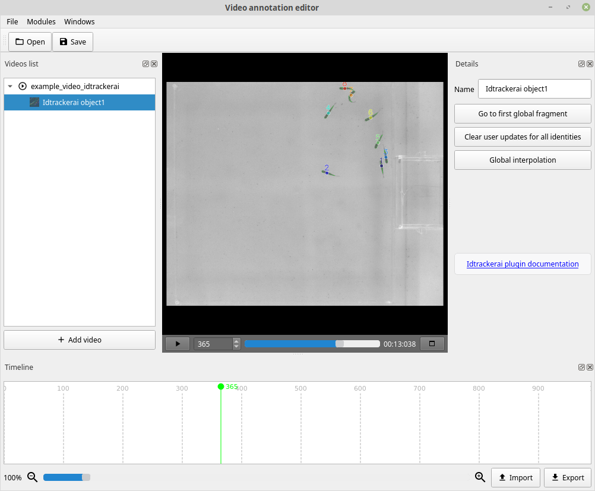

Validation GUI
==============

In this version, the GUI to validate and correct the trajectories is separated from the GUI used to track the videos. The new validation GUI is a submodule of bigger project called `Python video annotator <https://pythonvideoannotator.readthedocs.io/en/master/index.html>`_ developed by the `Scientific Software Platform <http://neuro.fchampalimaud.org/en/research/platforms/staff/Scientific%20Software/>`_ at the Champalimaud Foundation.

However, it is very easy to access it and it is installed by default when you install idtracker.ai with GUI support.

Check the `idtrackerai validator GUI documentation <https://pythonvideoannotator.readthedocs.io/en/master/modules/idtrackerai.html>`_ to learn how to launch it, correct identities and save new trajectories files.

